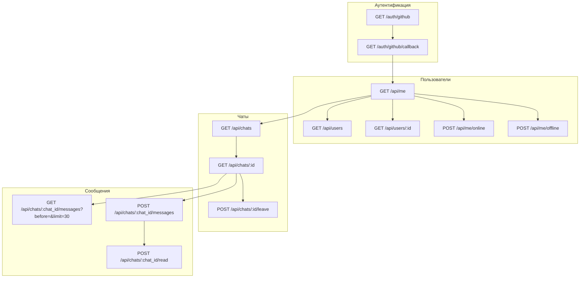

# API Endpoints

```mermaid
graph TD
    subgraph "Аутентификация"
        auth_github["GET /auth/github"]
        auth_callback["GET /auth/github/callback"]
    end

    subgraph "Пользователи"
        users_index["GET /api/users"]
        users_show["GET /api/users/:id"]
        users_me["GET /api/me"]
        users_online["POST /api/me/online"]
        users_offline["POST /api/me/offline"]
    end

    subgraph "Чаты"
        chats_index["GET /api/chats"]
        chats_show["GET /api/chats/:id"]
        chats_leave["POST /api/chats/:id/leave"]
    end

    subgraph "Сообщения"
        messages_index["GET /api/chats/:chat_id/messages?before=<message_id>&limit=30"]
        messages_create["POST /api/chats/:chat_id/messages"]
        messages_read["POST /api/chats/:chat_id/read"]
    end

    auth_github --> auth_callback
    auth_callback --> users_me
    
    users_me --> users_index
    users_me --> users_show
    users_me --> users_online
    users_me --> users_offline
    
    users_me --> chats_index
    chats_index --> chats_show
    chats_show --> chats_leave
    
    chats_show --> messages_index
    chats_show --> messages_create
    messages_create --> messages_read
```
