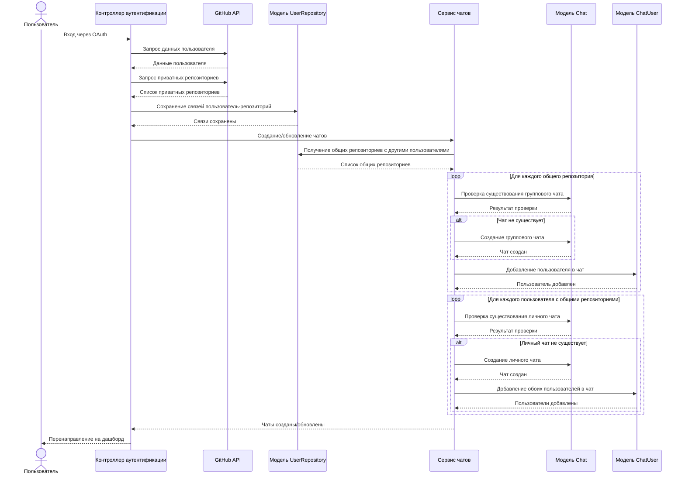

# Процесс создания чатов

```mermaid
sequenceDiagram
    actor User as Пользователь
    participant Auth as Контроллер аутентификации
    participant GitHub as GitHub API
    participant UserRepo as Модель UserRepository
    participant ChatService as Сервис чатов
    participant Chat as Модель Chat
    participant ChatUser as Модель ChatUser
    
    User->>Auth: Вход через OAuth
    Auth->>GitHub: Запрос данных пользователя
    GitHub-->>Auth: Данные пользователя
    Auth->>GitHub: Запрос приватных репозиториев
    GitHub-->>Auth: Список приватных репозиториев
    
    Auth->>UserRepo: Сохранение связей пользователь-репозиторий
    UserRepo-->>Auth: Связи сохранены
    
    Auth->>ChatService: Создание/обновление чатов
    
    ChatService->>UserRepo: Получение общих репозиториев с другими пользователями
    UserRepo-->>ChatService: Список общих репозиториев
    
    loop Для каждого общего репозитория
        ChatService->>Chat: Проверка существования группового чата
        Chat-->>ChatService: Результат проверки
        
        alt Чат не существует
            ChatService->>Chat: Создание группового чата
            Chat-->>ChatService: Чат создан
        end
        
        ChatService->>ChatUser: Добавление пользователя в чат
        ChatUser-->>ChatService: Пользователь добавлен
    end
    
    loop Для каждого пользователя с общими репозиториями
        ChatService->>Chat: Проверка существования личного чата
        Chat-->>ChatService: Результат проверки
        
        alt Личный чат не существует
            ChatService->>Chat: Создание личного чата
            Chat-->>ChatService: Чат создан
            
            ChatService->>ChatUser: Добавление обоих пользователей в чат
            ChatUser-->>ChatService: Пользователи добавлены
        end
    end
    
    ChatService-->>Auth: Чаты созданы/обновлены
    Auth-->>User: Перенаправление на дашборд
```
