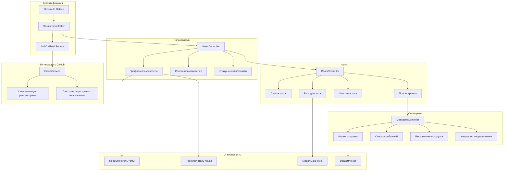

# Структура компонентов

```mermaid
graph TD
    subgraph "Аутентификация"
        OmniAuth[OmniAuth GitHub]
        SessionsController[SessionsController]
        AuthCallbackService[AuthCallbackService]
    end

    subgraph "Пользователи"
        UsersController[UsersController]
        UserProfile[Профиль пользователя]
        UsersList[Список пользователей]
        OnlineStatus[Статус онлайн/офлайн]
    end

    subgraph "Чаты"
        ChatsController[ChatsController]
        ChatList[Список чатов]
        ChatView[Просмотр чата]
        ChatParticipants[Участники чата]
        LeaveChat[Выход из чата]
    end

    subgraph "Сообщения"
        MessagesController[MessagesController]
        MessageForm[Форма отправки]
        MessagesList[Список сообщений]
        InfiniteScroll[Бесконечная прокрутка]
        UnreadIndicator[Индикатор непрочитанных]
    end

    subgraph "Интеграция с GitHub"
        GithubService[GithubService]
        RepositorySync[Синхронизация репозиториев]
        UserDataSync[Синхронизация данных пользователя]
    end

    subgraph "UI компоненты"
        ThemeToggle[Переключатель темы]
        LanguageSwitcher[Переключатель языка]
        Modal[Модальные окна]
        Notifications[Уведомления]
    end

    OmniAuth --> SessionsController
    SessionsController --> AuthCallbackService
    AuthCallbackService --> GithubService
    
    GithubService --> RepositorySync
    GithubService --> UserDataSync
    
    SessionsController --> UsersController
    UsersController --> UserProfile
    UsersController --> UsersList
    UsersController --> OnlineStatus
    
    UsersController --> ChatsController
    ChatsController --> ChatList
    ChatsController --> ChatView
    ChatsController --> ChatParticipants
    ChatsController --> LeaveChat
    
    ChatView --> MessagesController
    MessagesController --> MessageForm
    MessagesController --> MessagesList
    MessagesController --> InfiniteScroll
    MessagesController --> UnreadIndicator
    
    UserProfile --> ThemeToggle
    UserProfile --> LanguageSwitcher
    LeaveChat --> Modal
    MessageForm --> Notifications
```
