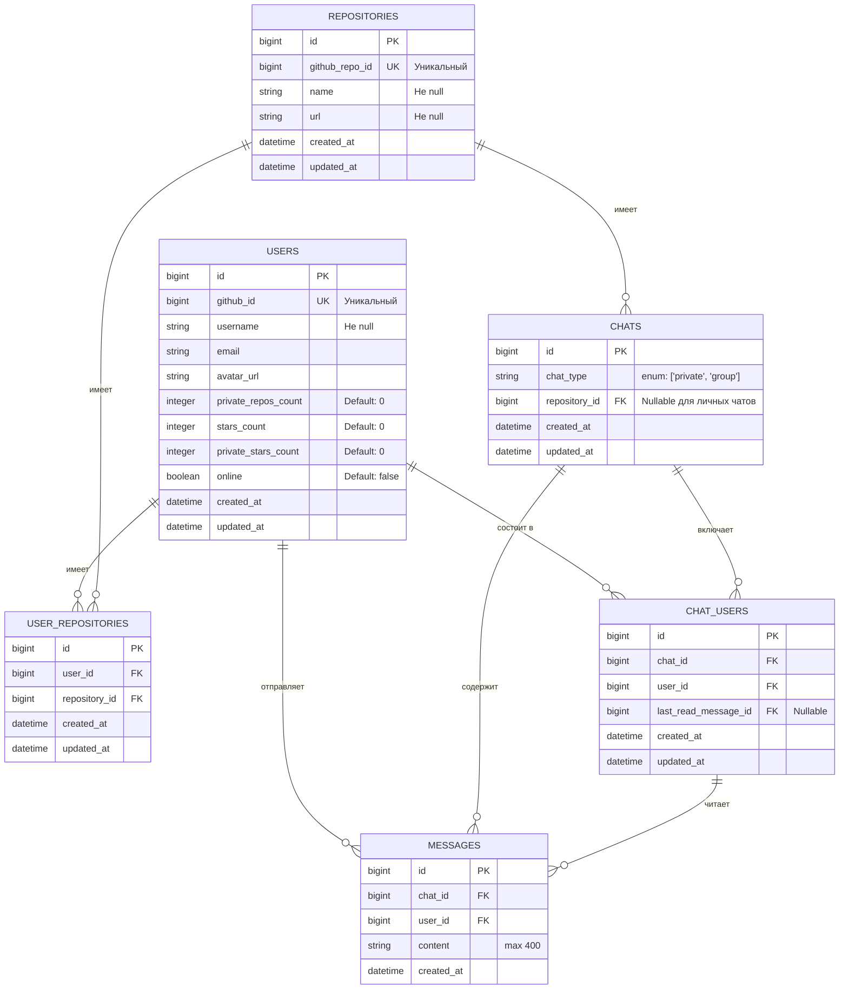

# Схема базы данных

```mermaid
erDiagram
    USERS {
        bigint id PK
        bigint github_id UK "Уникальный"
        string username "Не null"
        string email
        string avatar_url
        integer private_repos_count "Default: 0"
        integer stars_count "Default: 0"
        integer private_stars_count "Default: 0"
        boolean online "Default: false"
        datetime created_at
        datetime updated_at
    }

    REPOSITORIES {
        bigint id PK
        bigint github_repo_id UK "Уникальный"
        string name "Не null"
        string url "Не null"
        datetime created_at
        datetime updated_at
    }

    USER_REPOSITORIES {
        bigint id PK
        bigint user_id FK
        bigint repository_id FK
        datetime created_at
        datetime updated_at
    }

    CHATS {
        bigint id PK
        string chat_type "enum: ['private', 'group']"
        bigint repository_id FK "Nullable для личных чатов"
        datetime created_at
        datetime updated_at
    }

    MESSAGES {
        bigint id PK
        bigint chat_id FK
        bigint user_id FK
        string content "max 400"
        datetime created_at
    }

    CHAT_USERS {
        bigint id PK
        bigint chat_id FK
        bigint user_id FK
        bigint last_read_message_id FK "Nullable"
        datetime created_at
        datetime updated_at
    }

    USERS ||--o{ USER_REPOSITORIES : "имеет"
    REPOSITORIES ||--o{ USER_REPOSITORIES : "имеет"
    REPOSITORIES ||--o{ CHATS : "имеет"
    USERS ||--o{ CHAT_USERS : "состоит в"
    CHATS ||--o{ CHAT_USERS : "включает"
    USERS ||--o{ MESSAGES : "отправляет"
    CHATS ||--o{ MESSAGES : "содержит"
    CHAT_USERS ||--o{ MESSAGES : "читает"
```
