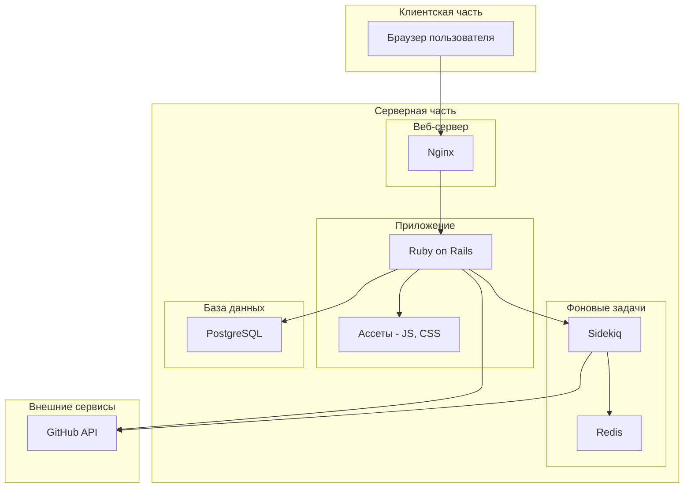

# Архитектура развертывания

```mermaid
graph TD
    subgraph "Клиентская часть"
        Browser[Браузер пользователя]
    end

    subgraph "Серверная часть"
        subgraph "Веб-сервер"
            Nginx[Nginx]
        end
        
        subgraph "Приложение"
            Rails[Ruby on Rails]
            Assets[Ассеты - JS, CSS]
        end
        
        subgraph "Фоновые задачи"
            Sidekiq[Sidekiq]
            Redis[Redis]
        end
        
        subgraph "База данных"
            PostgreSQL[PostgreSQL]
        end
    end

    subgraph "Внешние сервисы"
        GithubAPI[GitHub API]
    end

    Browser --> Nginx
    Nginx --> Rails
    Rails --> Assets
    Rails --> Sidekiq
    Sidekiq --> Redis
    Rails --> PostgreSQL
    Rails --> GithubAPI
    Sidekiq --> GithubAPI
```
