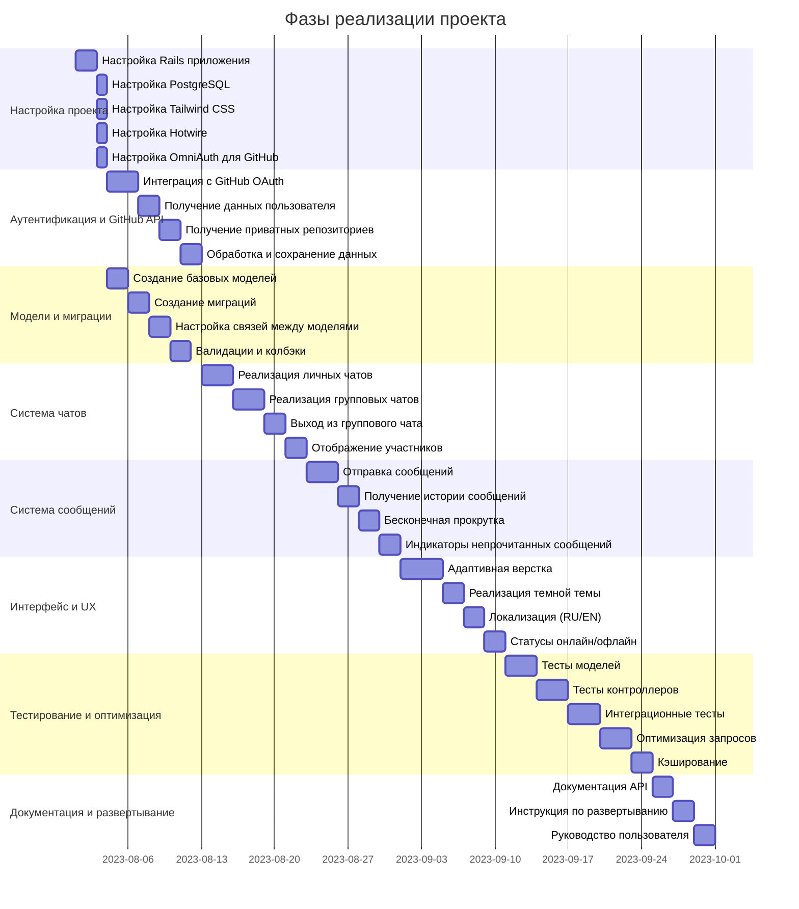

# Фазы реализации проекта

```mermaid
gantt
    title Фазы реализации проекта
    dateFormat  YYYY-MM-DD
    
    section Настройка проекта
    Настройка Rails приложения           :a1, 2023-08-01, 2d
    Настройка PostgreSQL                 :a2, after a1, 1d
    Настройка Tailwind CSS               :a3, after a1, 1d
    Настройка Hotwire                    :a4, after a1, 1d
    Настройка OmniAuth для GitHub        :a5, after a1, 1d
    
    section Аутентификация и GitHub API
    Интеграция с GitHub OAuth            :b1, after a5, 3d
    Получение данных пользователя        :b2, after b1, 2d
    Получение приватных репозиториев     :b3, after b2, 2d
    Обработка и сохранение данных        :b4, after b3, 2d
    
    section Модели и миграции
    Создание базовых моделей             :c1, after a2, 2d
    Создание миграций                    :c2, after c1, 2d
    Настройка связей между моделями      :c3, after c2, 2d
    Валидации и колбэки                  :c4, after c3, 2d
    
    section Система чатов
    Реализация личных чатов              :d1, after b4, 3d
    Реализация групповых чатов           :d2, after d1, 3d
    Выход из группового чата             :d3, after d2, 2d
    Отображение участников               :d4, after d3, 2d
    
    section Система сообщений
    Отправка сообщений                   :e1, after d4, 3d
    Получение истории сообщений          :e2, after e1, 2d
    Бесконечная прокрутка                :e3, after e2, 2d
    Индикаторы непрочитанных сообщений   :e4, after e3, 2d
    
    section Интерфейс и UX
    Адаптивная верстка                   :f1, after e4, 4d
    Реализация темной темы               :f2, after f1, 2d
    Локализация (RU/EN)                  :f3, after f2, 2d
    Статусы онлайн/офлайн                :f4, after f3, 2d
    
    section Тестирование и оптимизация
    Тесты моделей                        :g1, after f4, 3d
    Тесты контроллеров                   :g2, after g1, 3d
    Интеграционные тесты                 :g3, after g2, 3d
    Оптимизация запросов                 :g4, after g3, 3d
    Кэширование                          :g5, after g4, 2d
    
    section Документация и развертывание
    Документация API                     :h1, after g5, 2d
    Инструкция по развертыванию          :h2, after h1, 2d
    Руководство пользователя             :h3, after h2, 2d
```
