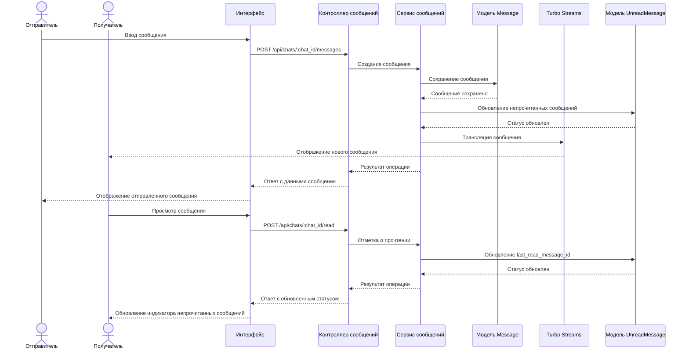

# Процесс обмена сообщениями

```mermaid
sequenceDiagram
    actor Sender as Отправитель
    actor Receiver as Получатель
    participant UI as Интерфейс
    participant MessagesController as Контроллер сообщений
    participant MessageService as Сервис сообщений
    participant Message as Модель Message
    participant Turbo as Turbo Streams
    participant UnreadMessage as Модель UnreadMessage
    
    Sender->>UI: Ввод сообщения
    UI->>MessagesController: POST /api/chats/:chat_id/messages
    MessagesController->>MessageService: Создание сообщения
    MessageService->>Message: Сохранение сообщения
    Message-->>MessageService: Сообщение сохранено
    
    MessageService->>UnreadMessage: Обновление непрочитанных сообщений
    UnreadMessage-->>MessageService: Статус обновлен
    
    MessageService->>Turbo: Трансляция сообщения
    Turbo-->>Receiver: Отображение нового сообщения
    
    MessageService-->>MessagesController: Результат операции
    MessagesController-->>UI: Ответ с данными сообщения
    UI-->>Sender: Отображение отправленного сообщения
    
    Receiver->>UI: Просмотр сообщения
    UI->>MessagesController: POST /api/chats/:chat_id/read
    MessagesController->>MessageService: Отметка о прочтении
    MessageService->>UnreadMessage: Обновление last_read_message_id
    UnreadMessage-->>MessageService: Статус обновлен
    
    MessageService-->>MessagesController: Результат операции
    MessagesController-->>UI: Ответ с обновленным статусом
    UI-->>Receiver: Обновление индикатора непрочитанных сообщений
```
