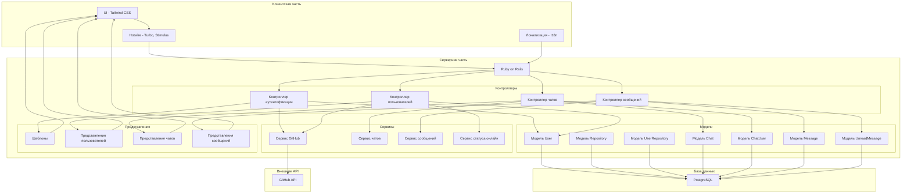

# Архитектура системы

```mermaid
graph TD
    subgraph "Клиентская часть"
        UI[UI - Tailwind CSS]
        Hotwire[Hotwire - Turbo, Stimulus]
        I18n[Локализация - I18n]
    end

    subgraph "Серверная часть"
        Rails[Ruby on Rails]
        
        subgraph "Контроллеры"
            AuthController[Контроллер аутентификации]
            UsersController[Контроллер пользователей]
            ChatsController[Контроллер чатов]
            MessagesController[Контроллер сообщений]
        end
        
        subgraph "Модели"
            User[Модель User]
            Repository[Модель Repository]
            UserRepository[Модель UserRepository]
            Chat[Модель Chat]
            ChatUser[Модель ChatUser]
            Message[Модель Message]
            UnreadMessage[Модель UnreadMessage]
        end
        
        subgraph "Сервисы"
            GithubService[Сервис GitHub]
            ChatService[Сервис чатов]
            MessageService[Сервис сообщений]
            OnlineStatusService[Сервис статуса онлайн]
        end
        
        subgraph "Представления"
            Layouts[Шаблоны]
            UserViews[Представления пользователей]
            ChatViews[Представления чатов]
            MessageViews[Представления сообщений]
        end
    end

    subgraph "База данных"
        PostgreSQL[PostgreSQL]
    end

    subgraph "Внешние API"
        GithubAPI[GitHub API]
    end

    UI --> Hotwire
    Hotwire --> Rails
    I18n --> Rails
    
    Rails --> AuthController
    Rails --> UsersController
    Rails --> ChatsController
    Rails --> MessagesController
    
    AuthController --> User
    UsersController --> User
    ChatsController --> Chat
    ChatsController --> ChatUser
    MessagesController --> Message
    MessagesController --> UnreadMessage
    
    AuthController --> GithubService
    UsersController --> GithubService
    ChatsController --> ChatService
    MessagesController --> MessageService
    UsersController --> OnlineStatusService
    
    GithubService --> GithubAPI
    
    User --> PostgreSQL
    Repository --> PostgreSQL
    UserRepository --> PostgreSQL
    Chat --> PostgreSQL
    ChatUser --> PostgreSQL
    Message --> PostgreSQL
    UnreadMessage --> PostgreSQL
    
    AuthController --> Layouts
    UsersController --> UserViews
    ChatsController --> ChatViews
    MessagesController --> MessageViews
    
    Layouts --> UI
    UserViews --> UI
    ChatViews --> UI
    MessageViews --> UI
```
