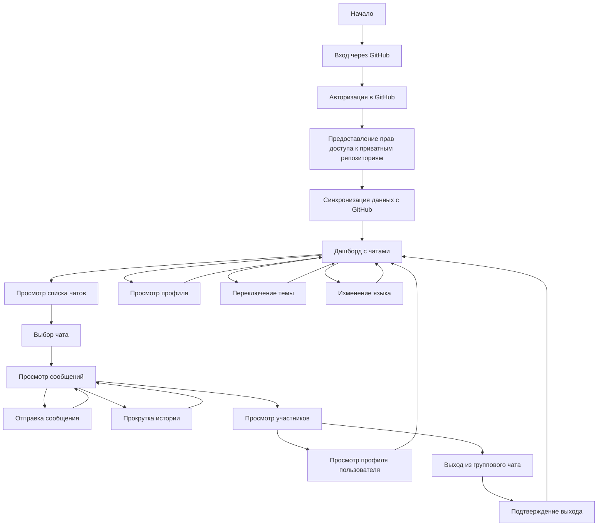

# Пользовательский поток

```mermaid
graph TD
    Start[Начало] --> Login[Вход через GitHub]
    Login --> AuthorizeGithub[Авторизация в GitHub]
    AuthorizeGithub --> GrantPermissions[Предоставление прав доступа к приватным репозиториям]
    GrantPermissions --> SyncData[Синхронизация данных с GitHub]
    SyncData --> Dashboard[Дашборд с чатами]
    
    Dashboard --> ViewChats[Просмотр списка чатов]
    Dashboard --> ViewProfile[Просмотр профиля]
    Dashboard --> ToggleTheme[Переключение темы]
    Dashboard --> ChangeLanguage[Изменение языка]
    
    ViewChats --> SelectChat[Выбор чата]
    SelectChat --> ViewMessages[Просмотр сообщений]
    ViewMessages --> SendMessage[Отправка сообщения]
    ViewMessages --> ScrollHistory[Прокрутка истории]
    ViewMessages --> ViewParticipants[Просмотр участников]
    
    ViewParticipants --> ViewUserProfile[Просмотр профиля пользователя]
    ViewParticipants --> LeaveGroupChat[Выход из группового чата]
    
    LeaveGroupChat --> ConfirmLeave[Подтверждение выхода]
    ConfirmLeave --> Dashboard
    
    ViewUserProfile --> Dashboard
    SendMessage --> ViewMessages
    ScrollHistory --> ViewMessages
    ViewProfile --> Dashboard
    ToggleTheme --> Dashboard
    ChangeLanguage --> Dashboard
```
