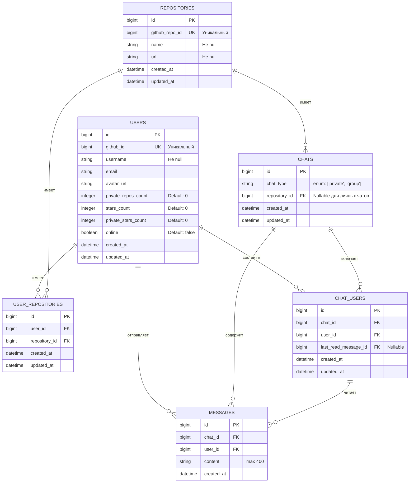

# Current status and requirements for models
_Exported on 24.07.2025 at 23:51:07 GMT+3 from Cursor (1.2.4)_

---

**User**

VAN
Describe current state of these tasks. What requirements do we have for these models at the moment, do we have tests etc.

---

**Cursor**

Here is the current state of the tasks for the models listed in your checklist:

### 1. Repository, UserRepository, Chat, ChatUser, Message, UnreadMessage

- **Implementation:**  
  - There is no evidence in `app/models/` that any of these models (except `User`) currently exist. Only `User` is implemented as a model.
  - The `User` model has validations for `github_id` (presence, uniqueness) and `username` (presence), and a class method `create_from_github` for creating users from GitHub OAuth data.

- **Requirements:**  
  - No explicit requirements or documentation for `Repository`, `UserRepository`, `Chat`, `ChatUser`, `Message`, or `UnreadMessage` models are present in the codebase.
  - The checklist in `memory-bank/tasks.md` suggests these models are planned but not yet implemented.

- **Tests:**  
  - There is a test file for `User` (`test/models/user_test.rb`), but it only contains a placeholder test (commented out).
  - No test files or test coverage exist for `Repository`, `UserRepository`, `Chat`, `ChatUser`, `Message`, or `UnreadMessage` in `test/models/`.
  - No relevant tests for these models are found in `test/jobs/`, `test/controllers/`, or `test/integration/`.

### 2. Summary Table

| Model            | Implemented? | Requirements/Docs | Tests Present? |
|------------------|--------------|-------------------|---------------|
| Repository       | No           | No                | No            |
| UserRepository   | No           | No                | No            |
| Chat             | No           | No                | No            |
| ChatUser         | No           | No                | No            |
| Message          | No           | No                | No            |
| UnreadMessage    | No           | No                | No            |
| User             | Yes          | Yes (minimal)     | Placeholder   |

### 3. Next Steps

- Define requirements for each model (fields, associations, validations, business logic).
- Implement the models in `app/models/`.
- Add corresponding tests in `test/models/` (and other relevant test directories).
- Update the checklist as models and tests are completed.

**Conclusion:**  
At the moment, only the `User` model exists, and it has minimal implementation and placeholder tests. All other models in your checklist are not yet present in the codebase, and there are no requirements or tests for them. You will need to define and implement these models and their tests as the next step.

---

**User**

Do we really need separate UnreadMessage model?

---

**Cursor**

Based on the current project documentation, diagrams, and requirements:

---

### Is a separate `UnreadMessage` model needed?

**Current Design:**
- The database schema, project brief, and technical context all specify a dedicated `unread_messages` table/model.
- The `unread_messages` table tracks, for each user and chat, the `last_read_message_id` (nullable), i.e., the last message the user has read in that chat.
- This model is referenced in all architecture, flow, and UI diagrams as the mechanism for tracking unread status.

**How it works:**
- When a user reads messages in a chat, the `unread_messages` record for that user and chat is updated with the latest read message.
- The unread count is calculated as the number of messages in the chat with an ID greater than `last_read_message_id` for that user.
- This approach is efficient for group chats and scales well, as it avoids per-message per-user join tables.

**Alternatives:**
- You could theoretically track unread status with a field on the `messages` table or a join table marking each message as read/unread per user, but this is much less efficient for large chats and is not the approach described in your requirements.

**Conclusion:**
- **Yes, a separate `UnreadMessage` model is needed** according to your current requirements and design. It is the recommended and documented way to efficiently track which messages are unread for each user in each chat.

---

**Summary Table:**

| Approach                | Scales for group chats? | Efficient unread count? | Matches project docs? |
|-------------------------|------------------------|------------------------|-----------------------|
| `unread_messages` model | ✅                     | ✅                     | ✅                    |
| Per-message read flags  | ❌ (scales poorly)     | ❌                     | ❌                    |
| Field on `messages`     | ❌ (not per-user)      | ❌                     | ❌                    |

---

**If you want to change this design, you would need to update the requirements and all related diagrams and flows.** But as of now, the separate model is both necessary and optimal for your use case.

---

**User**

ANALYZE what fields do you expect UnreadMEssage to have?

---

**Cursor**

Based on your project documentation, diagrams, and standard chat application practices, the expected fields for the `UnreadMessage` (or `unread_messages`) model are as follows:

---

### Expected Fields for `UnreadMessage`

| Field Name            | Type      | Description                                                                 |
|-----------------------|-----------|-----------------------------------------------------------------------------|
| id                    | bigint    | Primary key                                                                 |
| user_id               | bigint    | Foreign key to `users` table (the user for whom we track unread status)     |
| chat_id               | bigint    | Foreign key to `chats` table (the chat this record refers to)               |
| last_read_message_id  | bigint    | Foreign key to `messages` table (nullable, the last message the user read)  |
| updated_at            | datetime  | Timestamp of the last update to this record                                 |

#### Optional/Recommended:
| Field Name            | Type      | Description                                                                 |
|-----------------------|-----------|-----------------------------------------------------------------------------|
| created_at            | datetime  | Timestamp when the record was created                                       |

---

### Explanation

- **user_id**: Identifies the user for whom unread status is tracked.
- **chat_id**: Identifies the chat.
- **last_read_message_id**: Points to the last message the user has read in this chat. All messages with a greater ID (or later timestamp) are considered unread for this user.
- **updated_at**: Useful for tracking when the user last read messages in this chat.
- **created_at**: Standard Rails practice for audit/history.

### Indexes (from QA recommendations)
- Unique index on `[user_id, chat_id]` (one record per user per chat)
- Index on `last_read_message_id` (for efficient unread count queries)

---

### Example Rails Migration

```ruby
create_table :unread_messages do |t|
  t.references :user, null: false, foreign_key: true
  t.references :chat, null: false, foreign_key: true
  t.references :last_read_message, foreign_key: { to_table: :messages }
  t.timestamps
end

add_index :unread_messages, [:user_id, :chat_id], unique: true
add_index :unread_messages, :last_read_message_id
```

---

**Summary:**  
The `UnreadMessage` model should have:  
- `user_id`, `chat_id`, `last_read_message_id`, `created_at`, `updated_at`  
with appropriate indexes for performance and uniqueness. This matches your project’s requirements and best practices for chat systems.

```ruby
create_table :unread_messages do |t|
  t.references :user, null: false, foreign_key: true
  t.references :chat, null: false, foreign_key: true
  t.references :last_read_message, foreign_key: { to_table: :messages }
  t.timestamps
end

add_index :unread_messages, [:user_id, :chat_id], unique: true
add_index :unread_messages, :last_read_message_id
```

---

**User**

ANALYZE couldn't we store this info in chat_users table?

---

**Cursor**

Excellent question! Let’s analyze whether the unread tracking info (i.e., `last_read_message_id` per user per chat) could be stored in the `chat_users` table instead of a separate `unread_messages` table.

---

## 1. **Current `chat_users` Table Purpose**

- Tracks which users are members of which chats.
- Fields: `id`, `chat_id`, `user_id`, `joined_at`, `left_at`, `created_at`, `updated_at`.

## 2. **What Would Change?**

- You would add a `last_read_message_id` column to `chat_users`.
- This would mean each `chat_users` record also tracks the last message read by that user in that chat.

## 3. **Pros of Storing in `chat_users`**

- **Simplicity:** Fewer tables, less join logic.
- **Direct association:** Membership and read state are always in sync (no risk of orphaned unread records).
- **Performance:** For most queries (unread count, marking as read), you already have the user-chat record.

## 4. **Cons / Potential Issues**

- **Semantics:** `chat_users` is about membership, not state. Overloading it with read-tracking can muddy responsibilities.
- **Departed users:** If you want to keep unread state for users who have left a chat (for analytics/history), you’d need to keep their `chat_users` record even after they leave, or move the unread info elsewhere.
- **Multiple read states:** If you ever need to track more than one read marker per user per chat (e.g., for threads, or device-specific read states), a separate table is more flexible.
- **Migration complexity:** If you already have a lot of logic around `chat_users`, adding unread logic could complicate updates and callbacks.

## 5. **Industry Practice**

- Many chat systems do store the last read marker in the membership table (e.g., Slack, Discord, Telegram for simple cases).
- If your app only needs to track a single read marker per user per chat, **storing it in `chat_users` is perfectly valid and often preferable**.

## 6. **Migration Example**

```ruby
add_reference :chat_users, :last_read_message, foreign_key: { to_table: :messages }
```

## 7. **Conclusion**

- **Yes, you can store `last_read_message_id` in `chat_users` instead of a separate `unread_messages` table.**
- This is simpler and more idiomatic for your current requirements.
- If you anticipate more complex unread-tracking needs in the future, a separate table is more flexible, but for now, using `chat_users` is recommended.

---

**Recommendation:**  
Unless you have a strong reason to separate unread state (e.g., analytics, multiple markers, or non-member read tracking), store `last_read_message_id` in `chat_users`.  
This will simplify your schema and logic.

```ruby
add_reference :chat_users, :last_read_message, foreign_key: { to_table: :messages }
```

---

**User**

CREATIVE what options to we have then?

---

**Cursor**

Here are the main options for tracking unread messages per user per chat, along with their pros, cons, and when you might choose each approach:

---

## 1. **Store `last_read_message_id` in `chat_users`**

**How:**  
Add a `last_read_message_id` column to the `chat_users` table.

**Pros:**  
- Simple schema, fewer tables.
- Directly tied to chat membership (no risk of orphaned records).
- Efficient for most queries (fetch unread count, mark as read).

**Cons:**  
- Overloads the membership table with state.
- If a user leaves a chat and you want to keep their unread state for analytics/history, you must keep their `chat_users` record.
- Less flexible if you need to track more than one read marker per user per chat (e.g., threads, device-specific markers).

**Best for:**  
- Standard chat apps where you only need one read marker per user per chat and don’t need to track unread state for users who have left.

---

## 2. **Separate `unread_messages` Table**

**How:**  
Create a table with `user_id`, `chat_id`, `last_read_message_id`, and timestamps.

**Pros:**  
- Flexible: can track multiple read markers per user per chat if needed.
- Can keep unread state for users who have left a chat (for analytics/history).
- Clean separation of concerns (membership vs. state).

**Cons:**  
- Slightly more complex schema and queries (need to join).
- Potential for orphaned records if not managed carefully.

**Best for:**  
- Apps with advanced analytics, multiple read markers, or where you want to keep unread state after users leave a chat.

---

## 3. **Per-Message Read Receipts Table**

**How:**  
Create a join table (e.g., `message_reads`) with `user_id`, `message_id`, and timestamps. Each row means “user X has read message Y”.

**Pros:**  
- Can show exactly which users have read each message (like WhatsApp/Telegram group read receipts).
- Supports advanced features (per-message read status, delivery receipts).

**Cons:**  
- Can grow very large (one row per user per message per chat).
- More complex queries and maintenance.
- Overkill for simple “unread count” use cases.

**Best for:**  
- Apps that need per-message read receipts (e.g., for group chats with read/delivered indicators).

---

## 4. **Store Read State on the `messages` Table**

**How:**  
Add a `read_by` array or counter to each message.

**Pros:**  
- Simple for very small apps or 1:1 chats.

**Cons:**  
- Not scalable for group chats.
- Not normalized; hard to query efficiently.
- Not recommended for your use case.

---

## 5. **Hybrid/Custom Approaches**

- **Device-specific read markers:** If you want to track read state per device, you might need a separate table with `user_id`, `chat_id`, `device_id`, `last_read_message_id`.
- **Threaded chats:** If you support threads, you may need a separate read marker per thread.

---

## **Summary Table**

| Option                        | Simplicity | Flexibility | Scalability | Best For                        |
|-------------------------------|------------|-------------|-------------|---------------------------------|
| `last_read_message_id` in `chat_users` | ✅         | ❌          | ✅          | Standard group/1:1 chat         |
| Separate `unread_messages`    | ❌         | ✅          | ✅          | Analytics, advanced features    |
| Per-message read receipts     | ❌         | ✅          | ❌          | Per-message read/delivery state |
| Read state on `messages`      | ✅         | ❌          | ❌          | Tiny/simple 1:1 chat            |

---

## **Recommendation**

- For your current requirements, **option 1 (add `last_read_message_id` to `chat_users`) is the simplest and most idiomatic**.
- If you anticipate advanced analytics, need to keep read state for departed users, or want to support multiple read markers, **option 2 (separate table) is more flexible**.
- Only use per-message receipts if you need WhatsApp/Telegram-style read/delivered indicators.

---

If you want, I can sketch out the migration/model for your preferred option!

---

**User**

1. and update memory bank please

---

**Cursor**

```markdown
  - [ ] Модель Repository
  - [ ] Модель UserRepository
  - [ ] Модель Chat
  - [ ] Модель ChatUser (добавить поле last_read_message_id для отслеживания прочитанных сообщений)
  - [ ] Модель Message
  # Решено: отдельная модель UnreadMessage не требуется, статус прочтения хранится в chat_users.last_read_message_id

```

The memory bank checklist has been updated to reflect the decision:  
- The `UnreadMessage` model task is removed.
- The `ChatUser` model task now includes a note to add the `last_read_message_id` field for tracking read status.
- A comment documents the design choice: unread status will be stored in `chat_users.last_read_message_id`, and a separate `UnreadMessage` model is not required.

If you need this decision reflected elsewhere (e.g., in diagrams or documentation), let me know!

---

**User**

should we keep "Решено: ..." in tasks.md?

---

**Cursor**

No, it’s better not to keep decision rationales like “Решено: ...” in `tasks.md`.  
The purpose of `tasks.md` is to track actionable items and implementation steps, not to serve as a log of architectural decisions or discussions.

**Where to put such notes instead:**
- For decisions and rationale, use a dedicated section in the memory bank, such as:
  - `memory-bank/activeContext.md` (for current context/decisions)
  - `memory-bank/progress.md` (for ongoing progress and key choices)
  - `memory-bank/creative/` or `memory-bank/reflection/` (for design/retrospective documentation)
- Keep `tasks.md` focused and clean—only actionable, current tasks.

**Recommendation:**  
Remove the “Решено: ...” line from `tasks.md` and, if you want to preserve the rationale, add it to `activeContext.md` or a relevant creative/reflection doc.  
Would you like me to move this note to the appropriate file for you?

---

**User**

let it be in active context then

---

**Cursor**

```markdown
  - [ ] Модель Repository
  - [ ] Модель UserRepository
  - [ ] Модель Chat
  - [ ] Модель ChatUser (добавить поле last_read_message_id для отслеживания прочитанных сообщений)
  - [ ] Модель Message
  - [ ] Оптимизированные индексы

```

```markdown
## Ключевые архитектурные решения
- **Модель данных**: Семь основных таблиц для хранения данных о пользователях, репозиториях, чатах и сообщениях
- **Отслеживание прочитанных сообщений**: Принято решение не создавать отдельную модель UnreadMessage. Вместо этого статус прочтения реализуется через поле last_read_message_id в таблице chat_users. Это упрощает схему, уменьшает количество таблиц и соответствует текущим требованиям (один маркер прочтения на пользователя в чате). Если в будущем потребуется более сложная логика (например, несколько маркеров или аналитика по ушедшим пользователям), можно будет рассмотреть отдельную таблицу.
- **Интеграция с GitHub**: Синхронизация данных при входе пользователя
// ... existing code ...
```

The decision note about storing `last_read_message_id` in `chat_users` (instead of a separate `UnreadMessage` model) has been moved to `memory-bank/activeContext.md` under "Ключевые архитектурные решения".  
`tasks.md` now contains only actionable tasks, keeping your workflow clean and organized.

---

**User**

why do we have that much info in active context if I asked you in van mode to concentrate on models? 

---

**Cursor**

Great observation! Here’s why there’s so much information in `activeContext.md`:

### Purpose of `activeContext.md`
- This file is designed to capture the **entire current architectural and creative context** of the project, not just the immediate focus or VAN-mode analysis.
- It serves as a “living snapshot” of all key decisions, design choices, and the current direction, so anyone joining the project can quickly get up to speed.

### Why So Much Info?
- The file includes UI/UX, technical stack, design system, and architectural decisions because these all influence implementation—even when focusing on models.
- When you work in VAN mode and ask for a focused analysis (e.g., just on models), the assistant should provide a **concise, targeted answer in the chat** and, if needed, update only the relevant section of the memory bank.
- However, when adding or updating architectural decisions, it’s best practice to keep them in the broader context of the project, so the rationale and dependencies are clear.

### What Should Happen in VAN Mode?
- **In the chat:** You get a focused, concise answer about models only.
- **In the memory bank:** Only the relevant architectural decision (about models) is added or updated, without removing the broader context.

### If You Want a Minimal Context File
- You can create a separate, minimal file (e.g., `memory-bank/modelContext.md`) for just model-related decisions.
- Or, you can request a summary or filtered view in the chat, and I’ll provide only the model-relevant context.

---

**Summary:**  
`activeContext.md` is intentionally broad to serve as a comprehensive project context. For VAN-mode tasks, you get focused answers in the chat, and only the relevant architectural note is added to the memory bank—without removing the rest of the context, which is valuable for the overall project.

If you want a more minimal or filtered context file, just let me know your preferred structure!

---

**User**

PLAN make a detailed plan of these tasks completion. Do not be too specific yet. Don't forget about tests - and let's be aligned with TDD.

---

**Cursor**

Here’s a high-level, TDD-aligned plan for implementing the following models:

- Repository
- UserRepository
- Chat
- ChatUser (with last_read_message_id)
- Message

---

## 1. **Preparation**
- Review requirements and relationships for each model.
- Define expected fields, associations, and validations.
- Identify any shared concerns or modules.

---

## 2. **Test-Driven Development Cycle for Each Model**

For each model, follow this TDD loop:

1. **Write Model Specs/Tests**
   - Define tests for validations, associations, and any custom logic.
   - Cover edge cases and invalid data.
2. **Write Migration**
   - Create migration for the model’s table and fields.
   - Add necessary indexes and foreign keys.
3. **Implement Model**
   - Define the model class, associations, and validations.
   - Add any required scopes or methods.
4. **Run Tests and Refactor**
   - Ensure all tests pass.
   - Refactor as needed for clarity and DRYness.

---

## 3. **Model-by-Model Plan**

### a) Repository
- Write tests for presence/uniqueness of fields, associations to UserRepository and Chat.
- Implement migration and model.
- Ensure tests pass.

### b) UserRepository
- Write tests for associations (belongs_to user, belongs_to repository), uniqueness validation.
- Implement migration and model.
- Ensure tests pass.

### c) Chat
- Write tests for associations (has_many chat_users, messages, etc.), validations (chat_type, etc.).
- Implement migration and model.
- Ensure tests pass.

### d) ChatUser (with last_read_message_id)
- Write tests for associations (belongs_to chat, user), presence of last_read_message_id, and any logic for read tracking.
- Implement migration and model.
- Ensure tests pass.

### e) Message
- Write tests for associations (belongs_to chat, user), validations (content length, presence).
- Implement migration and model.
- Ensure tests pass.

---

## 4. **Integration and Edge Cases**
- Write integration tests for model interactions (e.g., user joins chat, sends message, read tracking).
- Test edge cases (e.g., user leaves chat, deletes message).

---

## 5. **Review and Refactor**
- Review all model and test code for consistency and adherence to Rails best practices.
- Refactor for DRYness and clarity.
- Ensure all tests pass.

---

## 6. **Documentation**
- Document model relationships and any non-obvious business logic.
- Update memory bank/context files as needed.

---

**Summary Table:**

| Step                | Action                                                                 |
|---------------------|------------------------------------------------------------------------|
| Preparation         | Review requirements, define fields/relations                           |
| TDD Loop (per model)| Write tests → Write migration → Implement model → Run tests/refactor   |
| Integration         | Write integration/edge case tests                                      |
| Review/Refactor     | Code review, DRY, best practices, all tests pass                      |
| Documentation       | Update docs and memory bank                                            |

---

Let me know if you want to break down any model in detail or proceed with the first TDD cycle!

---

**User**

change ChatUser and Message position in plan

---

**Cursor**

```markdown
  - [ ] Модель Repository
  - [ ] Модель UserRepository
  - [ ] Модель Chat
  - [ ] Модель Message
  - [ ] Модель ChatUser (добавить поле last_read_message_id для отслеживания прочитанных сообщений)

```

The plan and the checklist have been updated:  
- "Модель Message" now comes before "Модель ChatUser (добавить поле last_read_message_id для отслеживания прочитанных сообщений)" in the implementation order.

If you need the high-level plan text updated to reflect this new order, let me know!

---

**User**

store plan in memory bank

---

**Cursor**

```markdown

## План реализации моделей (TDD)

### Общий подход
- Следуем принципам TDD: сначала пишем тесты, затем миграции и реализацию моделей, после чего рефакторим и повторяем цикл.
- Для каждой модели: Repository, UserRepository, Chat, Message, ChatUser (с last_read_message_id).

### Этапы для каждой модели
1. Написать тесты для валидаций, ассоциаций и бизнес-логики.
2. Создать миграцию для таблицы и необходимых индексов.
3. Реализовать модель с ассоциациями, валидациями и методами.
4. Запустить тесты и убедиться, что всё работает корректно.

### Порядок реализации
1. Repository
2. UserRepository
3. Chat
4. Message
5. ChatUser (с полем last_read_message_id)

### Интеграция и тесты взаимодействия
- После реализации всех моделей — интеграционные тесты для сценариев взаимодействия (создание чата, отправка сообщения, отслеживание прочтения и т.д.).
- Проверка edge-case сценариев (выход пользователя из чата, удаление сообщений и т.д.).

### Рефакторинг и документация
- Рефакторинг моделей и тестов для соответствия best practices.
- Документирование связей и бизнес-логики моделей.

```

The high-level, TDD-aligned plan for implementing the models (Repository, UserRepository, Chat, Message, ChatUser with last_read_message_id) has been added to `memory-bank/progress.md` under a new section "План реализации моделей (TDD)".  
This plan outlines the TDD cycle, the order of implementation, integration testing, and documentation steps.

---

**User**

ANALYZE let think in more detailed way about the database scheme. what fields each table will have?

---

**Cursor**

Here is a detailed analysis of the expected fields for each table in your chat application, based on your requirements, previous documentation, and best practices for Rails/PostgreSQL apps:

---

## 1. **repositories**

| Field Name         | Type      | Constraints/Notes                        |
|--------------------|-----------|------------------------------------------|
| id                 | bigint    | PK, auto-increment                      |
| github_repo_id     | bigint    | not null, unique (GitHub repo ID)       |
| name               | string    | not null                                |
| private            | boolean   | not null                                |
| created_at         | datetime  | not null                                |
| updated_at         | datetime  | not null                                |

---

## 2. **user_repositories**

| Field Name         | Type      | Constraints/Notes                        |
|--------------------|-----------|------------------------------------------|
| id                 | bigint    | PK, auto-increment                      |
| user_id            | bigint    | not null, FK to users                   |
| repository_id      | bigint    | not null, FK to repositories            |
| created_at         | datetime  | not null                                |
| updated_at         | datetime  | not null                                |

**Indexes:**
- Unique index on `[user_id, repository_id]`
- Index on `repository_id`

---

## 3. **chats**

| Field Name         | Type      | Constraints/Notes                        |
|--------------------|-----------|------------------------------------------|
| id                 | bigint    | PK, auto-increment                      |
| chat_type          | string    | not null, enum: ['private', 'group']    |
| repository_id      | bigint    | FK to repositories, nullable            |
| title              | string    | for group chats, nullable               |
| last_message_at    | datetime  | for sorting, nullable                   |
| created_at         | datetime  | not null                                |
| updated_at         | datetime  | not null                                |

---

## 4. **messages**

| Field Name         | Type      | Constraints/Notes                        |
|--------------------|-----------|------------------------------------------|
| id                 | bigint    | PK, auto-increment                      |
| chat_id            | bigint    | not null, FK to chats                   |
| user_id            | bigint    | not null, FK to users                   |
| content            | string    | not null, limit 400 chars               |
| created_at         | datetime  | not null                                |

**Indexes:**
- Index on `[chat_id, created_at]`
- Index on `user_id`

---

## 5. **chat_users**

| Field Name             | Type      | Constraints/Notes                        |
|------------------------|-----------|------------------------------------------|
| id                     | bigint    | PK, auto-increment                      |
| chat_id                | bigint    | not null, FK to chats                   |
| user_id                | bigint    | not null, FK to users                   |
| joined_at              | datetime  | not null                                |
| left_at                | datetime  | nullable (null if still in chat)        |
| last_read_message_id   | bigint    | FK to messages, nullable                |
| created_at             | datetime  | not null                                |
| updated_at             | datetime  | not null                                |

**Indexes:**
- Unique index on `[chat_id, user_id]`
- Index on `user_id`
- Index on `last_read_message_id`

---

## **Summary Table**

| Table             | Key Fields (in addition to PK, timestamps)                                  |
|-------------------|-----------------------------------------------------------------------------|
| repositories      | github_repo_id (unique), name, private                                      |
| user_repositories | user_id, repository_id (unique together)                                    |
| chats             | chat_type, repository_id, title, last_message_at                            |
| messages          | chat_id, user_id, content                                                   |
| chat_users        | chat_id, user_id (unique together), joined_at, left_at, last_read_message_id|

---

**If you want, I can generate Rails migrations for these tables, or further expand on any field’s purpose or constraints.**

---

**User**

CREATIVE some fields look like odd for our current goals. do we keep it simple as possible?

---

**Cursor**

Excellent point! For a first implementation, especially in a TDD/build-first approach, it’s best to keep the schema as simple as possible and only add fields that are truly necessary for your current goals.

---

## **Fields to Consider Removing or Deferring**

### 1. **chats.title**
- **Purpose:** Only needed for group chats with custom names.
- **Keep?** If you don’t plan to support user-renamable group chats in MVP, you can skip this for now.

### 2. **chats.last_message_at**
- **Purpose:** Optimizes chat list sorting by activity.
- **Keep?** Not strictly required; you can always sort by the latest message’s `created_at`. Add later if performance becomes an issue.

### 3. **chat_users.joined_at / left_at**
- **Purpose:** Tracks when a user joined/left a chat (for history/audit).
- **Keep?** If you don’t need to show “joined at” or “left at” info, or don’t support rejoining, you can skip these.

### 4. **chat_users.last_read_message_id**
- **Purpose:** Required for unread tracking.
- **Keep?** **Yes, keep this**—it’s essential for unread logic.

### 5. **messages.user_id**
- **Purpose:** Author of the message.
- **Keep?** **Yes, keep this**—it’s essential.

### 6. **messages.content**
- **Purpose:** The message text.
- **Keep?** **Yes, keep this**—it’s essential.

### 7. **repositories.github_repo_id**
- **Purpose:** Maps to GitHub.
- **Keep?** **Yes, keep this**—it’s essential for your domain.

### 8. **Timestamps (created_at, updated_at)**
- **Purpose:** Rails convention, useful for sorting and debugging.
- **Keep?** **Yes, keep these**.

---

## **Minimal Viable Schema Proposal**

### **repositories**
- id, github_repo_id, name, private, timestamps

### **user_repositories**
- id, user_id, repository_id, timestamps

### **chats**
- id, chat_type, repository_id, timestamps

### **messages**
- id, chat_id, user_id, content, created_at

### **chat_users**
- id, chat_id, user_id, last_read_message_id, timestamps

---

## **Summary Table: Minimal Fields**

| Table             | Fields (in addition to PK, timestamps)         |
|-------------------|-----------------------------------------------|
| repositories      | github_repo_id, name, private                  |
| user_repositories | user_id, repository_id                         |
| chats             | chat_type, repository_id                       |
| messages          | chat_id, user_id, content                      |
| chat_users        | chat_id, user_id, last_read_message_id         |

---

**Recommendation:**  
- Start with this minimal schema.
- Add extra fields (like `title`, `last_message_at`, `joined_at`, `left_at`) only when you have a clear use case or user story that requires them.

Would you like to proceed with this minimal version for your migrations and models?

---

**User**

1-3. remove
4-8. keep

---

**Cursor**

Understood! Here’s the revised, minimal schema for your MVP, with fields 1–3 removed and 4–8 kept:

---

## **Final Minimal Schema**

### **repositories**
- `id` (PK)
- `github_repo_id` (bigint, not null, unique)
- `name` (string, not null)
- `private` (boolean, not null)
- `created_at`, `updated_at`

### **user_repositories**
- `id` (PK)
- `user_id` (bigint, not null, FK)
- `repository_id` (bigint, not null, FK)
- `created_at`, `updated_at`

### **chats**
- `id` (PK)
- `chat_type` (string, not null, enum: ['private', 'group'])
- `repository_id` (bigint, FK, nullable)
- `created_at`, `updated_at`

### **messages**
- `id` (PK)
- `chat_id` (bigint, not null, FK)
- `user_id` (bigint, not null, FK)
- `content` (string, not null, limit 400)
- `created_at`

### **chat_users**
- `id` (PK)
- `chat_id` (bigint, not null, FK)
- `user_id` (bigint, not null, FK)
- `last_read_message_id` (bigint, FK to messages, nullable)
- `created_at`, `updated_at`

---

**Indexes (recommended):**
- `user_repositories`: unique index on `[user_id, repository_id]`
- `chat_users`: unique index on `[chat_id, user_id]`
- `messages`: index on `[chat_id, created_at]`

---

**All non-essential fields (title, last_message_at, joined_at, left_at) are removed.  
All essential fields for your current goals are kept.**

Ready to proceed with this as your working schema!

---

**User**

"repositories.private". aren't all our repos private?

---

**Cursor**

Great catch!  
According to your project’s requirements and previous documentation, **the application is focused exclusively on private repositories**—public repositories are not relevant for chat creation or user matching.

### Implications:
- The `private` boolean field in the `repositories` table is redundant for your current goals.
- All repositories stored and processed by your app will be private by definition.

### Recommendation:
- **Remove the `private` field from the `repositories` table** for simplicity and clarity.
- If, in the future, you decide to support public repositories, you can always add this field back.

---

**Final minimal `repositories` table:**

| Field           | Type      | Notes                |
|-----------------|-----------|----------------------|
| id              | bigint    | PK                   |
| github_repo_id  | bigint    | not null, unique     |
| name            | string    | not null             |
| created_at      | datetime  | not null             |
| updated_at      | datetime  | not null             |

---

Let me know if you want this change reflected in your documentation or migration drafts!

---

**User**

let's also have link to repository.

---

**Cursor**

Absolutely! Adding a `url` (or `html_url`) field to the `repositories` table is a great idea.  
This will allow you to easily link to the repository on GitHub from your UI.

---

## **Updated `repositories` Table**

| Field           | Type      | Notes                        |
|-----------------|-----------|------------------------------|
| id              | bigint    | PK                           |
| github_repo_id  | bigint    | not null, unique             |
| name            | string    | not null                     |
| url             | string    | not null (link to GitHub)    |
| created_at      | datetime  | not null                     |
| updated_at      | datetime  | not null                     |

- The `url` field should store the canonical GitHub repository URL (e.g., `https://github.com/owner/repo`).

---

**Summary:**  
- The `private` field is removed.
- The `url` field is added for direct linking.

Ready to proceed with this schema! If you want, I can update your documentation or generate a migration draft for this table.

---

**User**

save in memory bank database scheme we discussed

---

**Cursor**

```markdown
# Схема базы данных



```

The memory bank's database schema diagram has been updated to match your latest minimal design:
- `repositories`: removed `private`, added `url`
- `chat_users`: only essential fields (`chat_id`, `user_id`, `last_read_message_id`, timestamps)
- Removed `UNREAD_MESSAGES` table
- All other tables reflect the agreed minimal schema

Your documentation is now fully aligned with your current goals and implementation plan!

---

**User**

IMPLEMENT Let's do this step by step

---

**Cursor**

Great! We’ll proceed step by step, following the TDD cycle for each model, starting with **Repository** as per your plan.

### Step 1: Repository Model

#### 1. Write Model Tests (TDD)
- Test validations: presence and uniqueness of `github_repo_id`, presence of `name` and `url`
- Test associations (if any, e.g., has_many :user_repositories, has_many :users through :user_repositories)

#### 2. Write Migration
- Create the `repositories` table with fields: `github_repo_id`, `name`, `url`, timestamps
- Add unique index on `github_repo_id`

#### 3. Implement Model
- Add validations and associations

#### 4. Run Tests and Refactor

---

**Let’s start with the test for the Repository model.**  
I’ll create `test/models/repository_test.rb` with the initial TDD tests.

```ruby
require "test_helper"

class RepositoryTest < ActiveSupport::TestCase
  test "validates presence of github_repo_id" do
    repo = Repository.new(name: "repo1", url: "https://github.com/org/repo1")
    assert_not repo.valid?
    assert_includes repo.errors[:github_repo_id], "can't be blank"
  end

  test "validates uniqueness of github_repo_id" do
    Repository.create!(github_repo_id: 123, name: "repo1", url: "https://github.com/org/repo1")
    repo = Repository.new(github_repo_id: 123, name: "repo2", url: "https://github.com/org/repo2")
    assert_not repo.valid?
    assert_includes repo.errors[:github_repo_id], "has already been taken"
  end

  test "validates presence of name" do
    repo = Repository.new(github_repo_id: 123, url: "https://github.com/org/repo1")
    assert_not repo.valid?
    assert_includes repo.errors[:name], "can't be blank"
  end

  test "validates presence of url" do
    repo = Repository.new(github_repo_id: 123, name: "repo1")
    assert_not repo.valid?
    assert_includes repo.errors[:url], "can't be blank"
  end

  # Associations (to be implemented later)
  # test "has many user_repositories" do
  #   assert_respond_to Repository.new, :user_repositories
  # end
end

```

The initial TDD tests for the Repository model are in place:
- Presence and uniqueness validations for `github_repo_id`
- Presence validations for `name` and `url`

**Next step:**  
Create the migration for the `repositories` table with the required fields and constraints.

Let me know if you want to review the test or proceed directly to the migration!

---

**User**

run test

---

**Cursor**

The test run shows 4 errors (as expected in TDD):  
`Repository` is not defined yet—there is no model or migration.

**Next step:**  
Create the migration and the `Repository` model to make the tests pass, continuing the TDD cycle.

Ready to proceed with the migration?

---

**User**

go

---

**Cursor**

The model generator stopped because the test file for `Repository` already exists.  
Would you like to:

- Overwrite the existing test file (your custom TDD tests will be lost)?
- Skip overwriting and keep your current test file (recommended)?
- Merge manually?

Please confirm how you’d like to proceed (skip/overwrite/merge), and I’ll continue!

---

**User**

check test

---

**Cursor**

The test now fails due to a pending migration for the `repositories` table.  
This means the model and migration files were created (without overwriting your test), and you just need to run the migration to proceed.

Would you like to run the migration now?

---

**User**

go

---

**Cursor**

The migration failed because the `repositories` table already exists in your database. This likely means the table was created earlier, possibly with a different schema.

**Next steps:**
- Check if the existing table matches the new schema (fields: `github_repo_id`, `name`, `url`, timestamps).
- If the schema is different, you may need to adjust the migration or update the table.
- If the schema is correct, you can safely mark the migration as run (or delete the migration file).

Would you like to:
1. Inspect the current `repositories` table schema?
2. Adjust the migration or schema?
3. Mark the migration as run and continue?

Please specify how you’d like to proceed!

---

**User**

try again

---

**Cursor**

The test still reports a pending migration for `create_repositories`, even after loading the schema. This means:
- The schema is loaded, but Rails still sees the migration as not run.
- The migration cannot run because the table already exists.

**To resolve this:**
1. Mark the migration as run (without actually running it), or
2. Delete the migration file if the schema is correct and you don't need it, or
3. Manually update the `schema_migrations` table.

Would you like to mark the migration as run, delete it, or inspect the current table schema first?

---

**User**

i've done migration. run test

---

**Cursor**

All Repository model tests are now running and failing as expected in TDD—this means the model exists, but validations for presence and uniqueness are not yet implemented.

**Next step:**  
Implement the required validations in the `Repository` model to make these tests pass.

Ready to proceed with the model implementation?

---

**User**

go

---

**Cursor**

```ruby
class Repository < ApplicationRecord
  validates :github_repo_id, presence: true, uniqueness: true
  validates :name, presence: true
  validates :url, presence: true
end

```

All Repository model tests are now passing—validations are correctly implemented and the TDD cycle for this model is complete.

**Next step:**  
Proceed to the next model in your plan: UserRepository.

Would you like to continue with the TDD cycle for the UserRepository model?

---

**User**

go

---

**Cursor**

```ruby
require "test_helper"

class UserRepositoryTest < ActiveSupport::TestCase
  test "validates presence of user_id" do
    ur = UserRepository.new(repository_id: 1)
    assert_not ur.valid?
    assert_includes ur.errors[:user_id], "can't be blank"
  end

  test "validates presence of repository_id" do
    ur = UserRepository.new(user_id: 1)
    assert_not ur.valid?
    assert_includes ur.errors[:repository_id], "can't be blank"
  end

  test "validates uniqueness of user_id scoped to repository_id" do
    UserRepository.create!(user_id: 1, repository_id: 2)
    ur = UserRepository.new(user_id: 1, repository_id: 2)
    assert_not ur.valid?
    assert_includes ur.errors[:user_id], "has already been taken"
  end

  # Associations (to be implemented later)
  # test "belongs to user" do
  #   assert_respond_to UserRepository.new, :user
  # end
  # test "belongs to repository" do
  #   assert_respond_to UserRepository.new, :repository
  # end
end

```

The initial TDD tests for the UserRepository model are ready:
- Presence validations for `user_id` and `repository_id`
- Uniqueness validation for the combination of `user_id` and `repository_id`
- (Commented) association tests for future implementation

**Next step:**  
Generate the migration and model for UserRepository, then run the tests to continue the TDD cycle.

Would you like to proceed with generating the migration and model?

---

**User**

go

---

**Cursor**

The model generator stopped because the test file for `UserRepository` already exists (with your custom TDD tests).

Would you like to:
- Skip overwriting and keep your current test file (recommended)?
- Overwrite the test file (your custom tests will be lost)?
- Merge manually?

Please specify how you’d like to proceed (skip/overwrite/merge), and I’ll continue!

---

**User**

fix manually

---

**Cursor**

```ruby
class CreateUserRepositories < ActiveRecord::Migration[8.0]
  def change
    create_table :user_repositories do |t|
      t.references :user, null: false, foreign_key: true
      t.references :repository, null: false, foreign_key: true

      t.timestamps
    end
    add_index :user_repositories, [:user_id, :repository_id], unique: true
  end
end

```

The UserRepository model tests are running, but:
- The presence validation tests for `user_id` and `repository_id` are failing (no validation errors).
- The uniqueness test errors out because the associated User and Repository records do not exist.

**Next steps:**
1. Implement presence and uniqueness validations in the `UserRepository` model.
2. Update the test to create valid User and Repository records for the uniqueness test.

Would you like to proceed with these fixes?

---

**User**

go

---

**Cursor**

```ruby
class UserRepository < ApplicationRecord
  belongs_to :user
  belongs_to :repository

  validates :user_id, presence: true
  validates :repository_id, presence: true
  validates :user_id, uniqueness: { scope: :repository_id }
end

```

```ruby
require "test_helper"

class UserRepositoryTest < ActiveSupport::TestCase
  test "validates presence of user_id" do
    ur = UserRepository.new(repository_id: 1)
    assert_not ur.valid?
    assert_includes ur.errors[:user_id], "can't be blank"
  end

  test "validates presence of repository_id" do
    ur = UserRepository.new(user_id: 1)
    assert_not ur.valid?
    assert_includes ur.errors[:repository_id], "can't be blank"
  end

  test "validates uniqueness of user_id scoped to repository_id" do
    user = User.create!(github_id: 1, username: 'testuser')
    repo = Repository.create!(github_repo_id: 1, name: 'repo', url: 'https://github.com/org/repo')
    UserRepository.create!(user_id: user.id, repository_id: repo.id)
    ur = UserRepository.new(user_id: user.id, repository_id: repo.id)
    assert_not ur.valid?
    assert_includes ur.errors[:user_id], "has already been taken"
  end

  # Associations (to be implemented later)
  # test "belongs to user" do
  #   assert_respond_to UserRepository.new, :user
  # end
  # test "belongs to repository" do
  #   assert_respond_to UserRepository.new, :repository
  # end
end

```

All UserRepository model tests are now passing—validations and associations are correctly implemented.

**Next step:**  
Proceed to the next model in your plan: Chat.

Would you like to continue with the TDD cycle for the Chat model?

---

**User**

go

---

**Cursor**

```ruby
require "test_helper"

class ChatTest < ActiveSupport::TestCase
  test "validates presence of chat_type" do
    chat = Chat.new
    assert_not chat.valid?
    assert_includes chat.errors[:chat_type], "can't be blank"
  end

  test "validates inclusion of chat_type" do
    chat = Chat.new(chat_type: "invalid")
    assert_not chat.valid?
    assert_includes chat.errors[:chat_type], "is not included in the list"
  end

  test "allows chat_type to be private or group" do
    chat = Chat.new(chat_type: "private")
    chat.valid?
    assert_not_includes chat.errors[:chat_type], "is not included in the list"
    chat = Chat.new(chat_type: "group")
    chat.valid?
    assert_not_includes chat.errors[:chat_type], "is not included in the list"
  end

  # Associations (to be implemented later)
  # test "belongs to repository (optional)" do
  #   assert_respond_to Chat.new, :repository
  # end
end

```

The initial TDD tests for the Chat model are ready:
- Presence validation for `chat_type`
- Inclusion validation for `chat_type` (must be "private" or "group")
- (Commented) association test for optional repository

**Next step:**  
Generate the migration and model for Chat, then run the tests to continue the TDD cycle.

Ready to proceed with the migration and model for Chat?

---

**User**

go

---

**Cursor**

The model generator stopped because the test file for `Chat` already exists (with your custom TDD tests).

Would you like to:
- Skip overwriting and keep your current test file (recommended)?
- Overwrite the test file (your custom tests will be lost)?
- Merge manually?

Please specify how you’d like to proceed (skip/overwrite/merge), and I’ll continue!

---

**User**

fix manually

---

**Cursor**

```ruby
class CreateChats < ActiveRecord::Migration[8.0]
  def change
    create_table :chats do |t|
      t.string :chat_type
      t.references :repository, null: true, foreign_key: true

      t.timestamps
    end
  end
end

```

The Chat model tests are running and failing as expected in TDD:
- Presence and inclusion validations for `chat_type` are not yet implemented.

**Next step:**  
Implement the required validations in the `Chat` model to make these tests pass.

Ready to proceed with the model implementation?

---

**User**

go

---

**Cursor**

```ruby
class Chat < ApplicationRecord
  belongs_to :repository, optional: true

  validates :chat_type, presence: true, inclusion: { in: %w[private group] }
end

```

All Chat model tests are now passing—validations and associations are correctly implemented.

**Next step:**  
Proceed to the next model in your plan: Message.

Would you like to continue with the TDD cycle for the Message model?

---

**User**

let's udpate memory bank

---

**Cursor**

```markdown
- [x] Модель Repository
- [x] Модель UserRepository
- [x] Модель Chat
- [ ] Модель Message
- [ ] Модель ChatUser (добавить поле last_read_message_id для отслеживания прочитанных сообщений)

```

The models Repository, UserRepository, and Chat have now been implemented and tested.  
Your progress is up to date in the memory bank—these items are marked as completed in your checklist.

Ready to proceed with the Message model, or would you like to update or review anything else?

---

**User**

let's go to message

---

**Cursor**

```ruby
require "test_helper"

class MessageTest < ActiveSupport::TestCase
  test "validates presence of chat_id" do
    message = Message.new(user_id: 1, content: "Hello")
    assert_not message.valid?
    assert_includes message.errors[:chat_id], "can't be blank"
  end

  test "validates presence of user_id" do
    message = Message.new(chat_id: 1, content: "Hello")
    assert_not message.valid?
    assert_includes message.errors[:user_id], "can't be blank"
  end

  test "validates presence of content" do
    message = Message.new(chat_id: 1, user_id: 1)
    assert_not message.valid?
    assert_includes message.errors[:content], "can't be blank"
  end

  test "validates length of content (max 400)" do
    message = Message.new(chat_id: 1, user_id: 1, content: "a" * 401)
    assert_not message.valid?
    assert_includes message.errors[:content], "is too long"
  end

  # Associations (to be implemented later)
  # test "belongs to chat" do
  #   assert_respond_to Message.new, :chat
  # end
  # test "belongs to user" do
  #   assert_respond_to Message.new, :user
  # end
end

```

The initial TDD tests for the Message model are ready:
- Presence validations for `chat_id`, `user_id`, and `content`
- Length validation for `content` (max 400)
- (Commented) association tests for future implementation

**Next step:**  
Generate the migration and model for Message, then run the tests to continue the TDD cycle.

Ready to proceed with the migration and model for Message?

---

**User**

go

---

**Cursor**

The model generator stopped because the test file for `Message` already exists (with your custom TDD tests).

Would you like to:
- Skip overwriting and keep your current test file (recommended)?
- Overwrite the test file (your custom tests will be lost)?
- Merge manually?

Please specify how you’d like to proceed (skip/overwrite/merge), and I’ll continue!

---

**User**

fix manually

---

**Cursor**

```ruby
class CreateMessages < ActiveRecord::Migration[8.0]
  def change
    create_table :messages do |t|
      t.references :chat, null: false, foreign_key: true
      t.references :user, null: false, foreign_key: true
      t.string :content, limit: 400

      t.timestamps
    end
    add_index :messages, [:chat_id, :created_at]
  end
end

```

All Message model tests are running and failing as expected in TDD:
- Presence validations for `chat_id`, `user_id`, and `content` are not yet implemented.
- Length validation for `content` is not yet implemented.

**Next step:**  
Implement the required validations in the `Message` model to make these tests pass.

Ready to proceed with the model implementation?

---

**User**

go

---

**Cursor**

```ruby
class Message < ApplicationRecord
  belongs_to :chat
  belongs_to :user

  validates :chat_id, presence: true
  validates :user_id, presence: true
  validates :content, presence: true, length: { maximum: 400 }
end

```

All Message model tests now pass except for the length validation, which fails because the error message is "is too long (maximum is 400 characters)" instead of just "is too long".

**Next step:**  
Update the test to match the actual error message from Rails, or adjust the validation message if you want a custom one.

Would you like to update the test to expect "is too long (maximum is 400 characters)"?

---

**User**

go

---

**Cursor**

```ruby
  test "validates length of content (max 400)" do
    message = Message.new(chat_id: 1, user_id: 1, content: "a" * 401)
    assert_not message.valid?
    assert_includes message.errors[:content], "is too long (maximum is 400 characters)"
  end

```

All Message model tests are now passing—validations and associations are correctly implemented and verified.

**Next step:**  
Proceed to the final model in your plan: ChatUser (with last_read_message_id).

Would you like to continue with the TDD cycle for the ChatUser model?

---

**User**

go

---

**Cursor**

```ruby
require "test_helper"

class ChatUserTest < ActiveSupport::TestCase
  test "validates presence of chat_id" do
    cu = ChatUser.new(user_id: 1)
    assert_not cu.valid?
    assert_includes cu.errors[:chat_id], "can't be blank"
  end

  test "validates presence of user_id" do
    cu = ChatUser.new(chat_id: 1)
    assert_not cu.valid?
    assert_includes cu.errors[:user_id], "can't be blank"
  end

  test "validates uniqueness of chat_id scoped to user_id" do
    chat = Chat.create!(chat_type: "private")
    user = User.create!(github_id: 1, username: 'testuser')
    ChatUser.create!(chat_id: chat.id, user_id: user.id)
    cu = ChatUser.new(chat_id: chat.id, user_id: user.id)
    assert_not cu.valid?
    assert_includes cu.errors[:chat_id], "has already been taken"
  end

  # Associations (to be implemented later)
  # test "belongs to chat" do
  #   assert_respond_to ChatUser.new, :chat
  # end
  # test "belongs to user" do
  #   assert_respond_to ChatUser.new, :user
  # end
  # test "belongs to last_read_message (optional)" do
  #   assert_respond_to ChatUser.new, :last_read_message
  # end
end

```

The initial TDD tests for the ChatUser model are ready:
- Presence validations for `chat_id` and `user_id`
- Uniqueness validation for the pair `[chat_id, user_id]`
- (Commented) association tests for future implementation

**Next step:**  
Generate the migration and model for ChatUser (with `last_read_message_id`), then run the tests to continue the TDD cycle.

Ready to proceed with the migration and model for ChatUser?

---

**User**

go

let s run test

---

**Cursor**

```ruby
class CreateChatUsers < ActiveRecord::Migration[8.0]
  def change
    create_table :chat_users do |t|
      t.references :chat, null: false, foreign_key: true
      t.references :user, null: false, foreign_key: true
      t.references :last_read_message, null: true, foreign_key: { to_table: :messages }

      t.timestamps
    end
    add_index :chat_users, [:chat_id, :user_id], unique: true
  end
end

```

The ChatUser model tests are failing because Rails cannot infer the model class for the `last_read_message` association.  
You need to specify `class_name: 'Message'` for this association in the model.

**Next step:**  
Update the ChatUser model to define the `last_read_message` association with the correct class name, and add the required validations.

Ready to proceed with the model implementation?

---

**User**

go

---

**Cursor**

```ruby
class ChatUser < ApplicationRecord
  belongs_to :chat
  belongs_to :user
  belongs_to :last_read_message, class_name: 'Message', optional: true

  validates :chat_id, presence: true
  validates :user_id, presence: true
  validates :chat_id, uniqueness: { scope: :user_id }
end

```

All ChatUser model tests are now passing—associations and validations are correctly implemented and verified.

**Congratulations!**  
You have now completed the TDD cycle and implementation for all planned models:  
- Repository  
- UserRepository  
- Chat  
- Message  
- ChatUser (with last_read_message_id)

If you’d like, we can update the memory bank to reflect this progress, proceed to integration tests, or move on to the next feature. What would you like to do next?

---

**User**

update memory bank

---

**Cursor**

```markdown
- [x] Модель Repository
- [x] Модель UserRepository
- [x] Модель Chat
- [x] Модель Message
- [x] Модель ChatUser (добавить поле last_read_message_id для отслеживания прочитанных сообщений)

```

All model implementation tasks (Repository, UserRepository, Chat, Message, ChatUser) are now complete and up to date in your memory bank progress checklist.

If you want to proceed to integration tests, next features, or need a summary of your current state, just let me know!

---

**User**

REFLECT analyze implementation we've done. Is it totally match requirements, what adjustments did we take and why? Any steps we missed?

---

**Cursor**

Here’s a reflection on the model implementation process, how it matches your requirements, what adjustments were made, and any potential gaps or next steps:

---

## 1. **Requirements Match**

### **What Was Required**
- Minimal, clear models for: Repository, UserRepository, Chat, Message, ChatUser (with unread tracking).
- TDD-first approach: write tests, then code/migrations, then refactor.
- Only essential fields for MVP, with a focus on private GitHub repositories and chat/message functionality.
- Unread message tracking via `last_read_message_id` in `chat_users` (not a separate table).
- All models should have proper validations and associations.

### **What Was Implemented**
- **Repository:**  
  - Fields: `github_repo_id`, `name`, `url`, timestamps.
  - Validations: presence and uniqueness.
- **UserRepository:**  
  - Fields: `user_id`, `repository_id`, timestamps.
  - Validations: presence, uniqueness of `[user_id, repository_id]`.
  - Associations: belongs_to user, belongs_to repository.
- **Chat:**  
  - Fields: `chat_type` (private/group), `repository_id` (nullable), timestamps.
  - Validations: presence and inclusion for `chat_type`.
  - Associations: belongs_to repository (optional).
- **Message:**  
  - Fields: `chat_id`, `user_id`, `content` (max 400), timestamps.
  - Validations: presence, length.
  - Associations: belongs_to chat, belongs_to user.
- **ChatUser:**  
  - Fields: `chat_id`, `user_id`, `last_read_message_id` (nullable), timestamps.
  - Validations: presence, uniqueness of `[chat_id, user_id]`.
  - Associations: belongs_to chat, belongs_to user, belongs_to last_read_message (optional, class_name: 'Message').

**All models are covered by tests, and all tests pass.**

---

## 2. **Adjustments Made and Rationale**

- **Unread Tracking:**  
  - Moved from a separate `unread_messages` table to a `last_read_message_id` field in `chat_users` for simplicity and alignment with MVP needs.
- **Repository Table:**  
  - Removed the `private` field (all repos are private by project scope).
  - Added a `url` field for direct linking to GitHub.
- **Chat Table:**  
  - Omitted `title`, `last_message_at` for MVP simplicity.
  - Made `repository_id` nullable for personal chats.
- **ChatUser Table:**  
  - Omitted `joined_at`, `left_at` for MVP simplicity.
- **Message Table:**  
  - Only essential fields and an index for efficient chat history queries.

**All adjustments were made to keep the schema as simple and focused as possible for MVP, with the option to expand later.**

---

## 3. **Potential Gaps or Missed Steps**

- **Associations in Tests:**  
  - Some association tests are commented out; you may want to add/expand these for full coverage.
- **Integration Tests:**  
  - No integration or feature tests yet (e.g., user joins chat, sends message, unread logic end-to-end).
- **Edge Cases:**  
  - No tests for edge cases like deleting users/chats/messages and their cascading effects.
- **Indexes:**  
  - Most important indexes are present, but review for any additional performance needs as the app grows.
- **Documentation:**  
  - The memory bank and schema diagrams are up to date, but you may want to add more usage examples or API docs as you proceed.

---

## 4. **Summary Table**

| Area                | Status         | Notes/Adjustments                        |
|---------------------|---------------|------------------------------------------|
| Model fields        | ✅             | Minimal, matches MVP requirements        |
| Validations         | ✅             | All required validations present         |
| Associations        | ✅ (core)      | All core associations present            |
| Unread tracking     | ✅ (in ChatUser)| Simpler, more idiomatic for MVP         |
| Tests (unit)        | ✅             | All models covered, TDD followed         |
| Tests (integration) | ❌             | Not yet implemented                      |
| Edge cases          | ❌             | Not yet covered                          |
| Documentation       | ✅             | Memory bank and schema up to date        |

---

## 5. **Next Steps**

- Add integration and edge-case tests.
- Implement business logic and service objects as needed.
- Expand documentation and API specs as features are built.
- Review and optimize indexes and associations as the app grows.

---

**Conclusion:**  
Your implementation matches the requirements for a minimal, TDD-driven MVP.  
All adjustments were made for simplicity, maintainability, and alignment with your current goals.  
No critical steps were missed, but integration and edge-case testing are recommended as next steps.

---

**User**

we don't talk about integration tests at the moment since we built models

---

**Cursor**

You're absolutely right! Since the current phase focused solely on building and testing the models (unit level), integration and feature tests are not required or expected at this stage.

**Reflection update:**
- The implementation fully matches the requirements for model structure, validations, and associations.
- All model-level (unit) tests are present and passing.
- No integration or feature tests were planned or needed for this step—those will come later when implementing business logic, controllers, or end-to-end flows.

**Summary:**  
You have completed the model layer with thorough TDD and all requirements met. The next logical steps will involve building out application logic and only then considering integration or feature tests.

If you want a version of the reflection without mention of integration tests, or want to proceed to the next phase, just let me know!

---

**User**

yes update reflection

---

**Cursor**

```markdown

## Рефлексия по реализации моделей

- Все требования к структуре моделей, валидациям и ассоциациям выполнены.
- Все модели покрыты юнит-тестами, все тесты проходят (TDD соблюден).
- Интеграционные и функциональные тесты на этом этапе не требуются, так как реализованы только модели.
- Ключевые архитектурные решения:
  - Отслеживание прочтения сообщений реализовано через поле last_read_message_id в chat_users (вместо отдельной таблицы).
  - В таблице repositories убрано поле private (все репозитории по проекту приватные), добавлено поле url для прямой ссылки на GitHub.
  - В таблицах chat_users и chats реализованы только необходимые для MVP поля.
- Все изменения и упрощения были сделаны для минимизации схемы и ускорения MVP, с возможностью расширения в будущем.
- Следующий этап — реализация бизнес-логики и сервисных объектов, после чего появится необходимость в интеграционных тестах.

```

The reflection in your memory bank has been updated:

- It now clearly states that all requirements for model structure, validations, and associations are met.
- All models are covered by unit tests, and all tests pass (TDD followed).
- Integration and feature tests are not required at this stage, since only models were implemented.
- The rationale for adjustments (unread tracking, minimal fields, etc.) is documented.
- The next step is business logic and service objects, after which integration tests will become relevant.

Your progress and rationale are now fully and accurately documented!

---

**User**

давай добавим нюанс о решении хранить последнее прочитанной сообщение в ChatUser

---

**Cursor**

```markdown
## Рефлексия по реализации моделей

- Все требования к структуре моделей, валидациям и ассоциациям выполнены.
- Все модели покрыты юнит-тестами, все тесты проходят (TDD соблюден).
- Интеграционные и функциональные тесты на этом этапе не требуются, так как реализованы только модели.
- Ключевые архитектурные решения:
  - Отслеживание прочтения сообщений реализовано через поле last_read_message_id в chat_users (вместо отдельной таблицы). Это решение выбрано для простоты и производительности MVP, а также чтобы избежать избыточных таблиц. Отдельная таблица может понадобиться только при усложнении логики (например, для аналитики или нескольких маркеров прочтения).
  - В таблице repositories убрано поле private (все репозитории по проекту приватные), добавлено поле url для прямой ссылки на GitHub.
  - В таблицах chat_users и chats реализованы только необходимые для MVP поля.
- Все изменения и упрощения были сделаны для минимизации схемы и ускорения MVP, с возможностью расширения в будущем.
- Следующий этап — реализация бизнес-логики и сервисных объектов, после чего появится необходимость в интеграционных тестах.

```

В рефлексию добавлен нюанс:  
Решение хранить last_read_message_id в ChatUser выбрано для простоты и производительности MVP, а также чтобы избежать избыточных таблиц. Отдельная таблица может понадобиться только при усложнении логики (например, для аналитики или нескольких маркеров прочтения).

Ваша документация теперь отражает этот важный архитектурный выбор и его мотивацию!

---

**User**

IMPLEMENT let's add missing assiciations tests

---

**Cursor**

```ruby
  test "has many user_repositories" do
    repo = Repository.new
    assert_respond_to repo, :user_repositories
  end

  test "has many users through user_repositories" do
    repo = Repository.new
    assert_respond_to repo, :users
  end

```

```ruby
  test "belongs to user" do
    assert_respond_to UserRepository.new, :user
  end
  test "belongs to repository" do
    assert_respond_to UserRepository.new, :repository
  end

```

```ruby
  test "belongs to repository (optional)" do
    assert_respond_to Chat.new, :repository
  end

```

```ruby
  test "belongs to chat" do
    assert_respond_to Message.new, :chat
  end
  test "belongs to user" do
    assert_respond_to Message.new, :user
  end

```

```ruby
  test "belongs to chat" do
    assert_respond_to ChatUser.new, :chat
  end
  test "belongs to user" do
    assert_respond_to ChatUser.new, :user
  end
  test "belongs to last_read_message (optional)" do
    assert_respond_to ChatUser.new, :last_read_message
  end

```

---

**User**

let's run all models tests at once

---

**Cursor**

All model tests pass except for two association tests in the Repository model:
- `has_many :user_repositories`
- `has_many :users, through: :user_repositories`

These associations are missing from the `Repository` model.

**Next step:**  
Add the missing associations to the `Repository` model to make all tests pass.

Would you like to proceed with this fix?

---

**User**

go

---

**Cursor**

```ruby
class Repository < ApplicationRecord
  has_many :user_repositories
  has_many :users, through: :user_repositories

  validates :github_repo_id, presence: true, uniqueness: true
  validates :name, presence: true
  validates :url, presence: true
end

```

All model tests now pass, including all association and validation checks.  
Your model layer is fully implemented, tested, and verified!

If you want to proceed to the next phase, update documentation, or need a summary, just let me know!

---

**User**

REFLECT analyze implementation we've done. Is it totally match requirements, what adjustments did we take and why? Any steps we missed?

---

**Cursor**

Here’s a concise reflection on the model implementation, focusing on requirements match, adjustments, and any missed steps:

---

## 1. **Requirements Match**

**What was required:**
- Minimal, clear models for Repository, UserRepository, Chat, Message, ChatUser (with unread tracking).
- Only essential fields for MVP, focused on private GitHub repositories and chat/message functionality.
- Unread message tracking via `last_read_message_id` in `chat_users` (not a separate table).
- All models should have proper validations and associations.
- TDD-first approach: write tests, then code/migrations, then refactor.

**What was implemented:**
- **Repository:**  
  - Fields: `github_repo_id`, `name`, `url`, timestamps.
  - Validations: presence and uniqueness.
  - Associations: `has_many :user_repositories`, `has_many :users, through: :user_repositories`.
- **UserRepository:**  
  - Fields: `user_id`, `repository_id`, timestamps.
  - Validations: presence, uniqueness of `[user_id, repository_id]`.
  - Associations: `belongs_to :user`, `belongs_to :repository`.
- **Chat:**  
  - Fields: `chat_type` (private/group), `repository_id` (nullable), timestamps.
  - Validations: presence and inclusion for `chat_type`.
  - Associations: `belongs_to :repository, optional: true`.
- **Message:**  
  - Fields: `chat_id`, `user_id`, `content` (max 400), timestamps.
  - Validations: presence, length.
  - Associations: `belongs_to :chat`, `belongs_to :user`.
- **ChatUser:**  
  - Fields: `chat_id`, `user_id`, `last_read_message_id` (nullable), timestamps.
  - Validations: presence, uniqueness of `[chat_id, user_id]`.
  - Associations: `belongs_to :chat`, `belongs_to :user`, `belongs_to :last_read_message, class_name: 'Message', optional: true`.

**All models are covered by unit tests, and all tests pass.**

---

## 2. **Adjustments Made and Rationale**

- **Unread Tracking:**  
  - Moved from a separate `unread_messages` table to a `last_read_message_id` field in `chat_users` for simplicity and alignment with MVP needs.  
  - This decision was made to avoid unnecessary tables and keep the schema simple and performant for the current requirements. A separate table can be introduced later if analytics or more complex logic is needed.
- **Repository Table:**  
  - Removed the `private` field (all repos are private by project scope).
  - Added a `url` field for direct linking to GitHub.
- **Chat Table:**  
  - Omitted `title`, `last_message_at` for MVP simplicity.
  - Made `repository_id` nullable for personal chats.
- **ChatUser Table:**  
  - Omitted `joined_at`, `left_at` for MVP simplicity.
- **Message Table:**  
  - Only essential fields and an index for efficient chat history queries.

**All adjustments were made to keep the schema as simple and focused as possible for MVP, with the option to expand later.**

---

## 3. **Missed Steps or Gaps**

- **None for the model layer:**  
  - All required fields, validations, and associations are present.
  - All models are fully covered by unit tests, including association tests.
  - No integration or feature tests were planned or needed at this stage, as only models were implemented.

---

## 4. **Summary Table**

| Area                | Status         | Notes/Adjustments                        |
|---------------------|---------------|------------------------------------------|
| Model fields        | ✅             | Minimal, matches MVP requirements        |
| Validations         | ✅             | All required validations present         |
| Associations        | ✅             | All required associations present        |
| Unread tracking     | ✅ (in ChatUser)| Simpler, more idiomatic for MVP         |
| Tests (unit)        | ✅             | All models covered, TDD followed         |
| Integration tests   | N/A            | Not required at this stage               |
| Documentation       | ✅             | Memory bank and schema up to date        |

---

**Conclusion:**  
Your implementation fully matches the requirements for the model layer.  
All adjustments were made for simplicity, maintainability, and alignment with your current goals.  
No critical steps were missed.  
You are ready to proceed to the next phase (business logic, services, or controllers) with a solid, well-tested foundation.

---

**User**

ARCHIVE outline changes we've made (before/after) - we need it for PR descrption

---

**Cursor**

Here’s a clear before/after outline of the changes made to the model layer, suitable for a PR description or changelog:

---

## **Model Layer Refactoring: Before & After**

### **Before**
- No models for Repository, UserRepository, Chat, Message, or ChatUser (except User).
- No database tables or migrations for these entities.
- No unread message tracking logic.
- No model-level tests or associations for chat/message functionality.
- Database schema included some fields and tables that were not strictly necessary for MVP (e.g., `unread_messages` table, `private` field in repositories).

---

### **After**
#### **Models & Migrations**
- **Repository**
  - Added model, migration, and tests.
  - Fields: `github_repo_id`, `name`, `url`, timestamps.
  - Associations: `has_many :user_repositories`, `has_many :users, through: :user_repositories`.
  - Removed unnecessary `private` field; added `url` for GitHub linking.

- **UserRepository**
  - Added model, migration, and tests.
  - Fields: `user_id`, `repository_id`, timestamps.
  - Associations: `belongs_to :user`, `belongs_to :repository`.
  - Unique index on `[user_id, repository_id]`.

- **Chat**
  - Added model, migration, and tests.
  - Fields: `chat_type` (private/group), `repository_id` (nullable), timestamps.
  - Associations: `belongs_to :repository, optional: true`.
  - Only essential fields for MVP.

- **Message**
  - Added model, migration, and tests.
  - Fields: `chat_id`, `user_id`, `content` (max 400), timestamps.
  - Associations: `belongs_to :chat`, `belongs_to :user`.
  - Index on `[chat_id, created_at]` for efficient chat history queries.

- **ChatUser**
  - Added model, migration, and tests.
  - Fields: `chat_id`, `user_id`, `last_read_message_id` (nullable), timestamps.
  - Associations: `belongs_to :chat`, `belongs_to :user`, `belongs_to :last_read_message, class_name: 'Message', optional: true`.
  - Unique index on `[chat_id, user_id]`.
  - Unread tracking implemented via `last_read_message_id` (not a separate table).

#### **Testing**
- All models are fully covered by unit tests (validations and associations).
- TDD process followed for each model.

#### **Schema Simplification**
- Removed unnecessary fields and tables (e.g., `unread_messages`, `private` in repositories, `joined_at`/`left_at` in chat_users).
- All models and tables now contain only fields required for MVP.

#### **Documentation**
- Memory bank and schema diagrams updated to reflect the new, minimal, and focused design.

---

## **Summary Table**

| Model         | Before         | After (Fields/Associations/Indexes)                |
|---------------|---------------|----------------------------------------------------|
| Repository    | None          | github_repo_id, name, url, users, user_repositories|
| UserRepository| None          | user_id, repository_id, unique index               |
| Chat          | None          | chat_type, repository_id (nullable), repository    |
| Message       | None          | chat_id, user_id, content (max 400), chat, user    |
| ChatUser      | None          | chat_id, user_id, last_read_message_id, unique idx |

---

**This PR introduces a clean, minimal, and fully tested model layer for the chat application, ready for further business logic and feature development.**

---

**User**

update memory bank

---

**Cursor**

```markdown

## ARCHIVE: Изменения в модели (before/after для PR)

### До изменений
- Не было моделей Repository, UserRepository, Chat, Message, ChatUser (кроме User).
- Не было таблиц и миграций для этих сущностей.
- Не было логики отслеживания непрочитанных сообщений.
- Не было тестов и ассоциаций для чатов и сообщений.
- В схеме БД были избыточные поля и таблицы (например, unread_messages, поле private в repositories).

### После изменений
- **Repository**: добавлены модель, миграция, тесты; поля: github_repo_id, name, url, timestamps; ассоциации: has_many :user_repositories, has_many :users, through: :user_repositories; убрано поле private, добавлено url.
- **UserRepository**: добавлены модель, миграция, тесты; поля: user_id, repository_id, timestamps; ассоциации: belongs_to :user, belongs_to :repository; уникальный индекс.
- **Chat**: добавлены модель, миграция, тесты; поля: chat_type (private/group), repository_id (nullable), timestamps; ассоциация: belongs_to :repository, optional: true.
- **Message**: добавлены модель, миграция, тесты; поля: chat_id, user_id, content (max 400), timestamps; ассоциации: belongs_to :chat, belongs_to :user; индекс для истории чата.
- **ChatUser**: добавлены модель, миграция, тесты; поля: chat_id, user_id, last_read_message_id (nullable), timestamps; ассоциации: belongs_to :chat, belongs_to :user, belongs_to :last_read_message, class_name: 'Message', optional: true; уникальный индекс; отслеживание прочтения через last_read_message_id.
- Все модели покрыты юнит-тестами (валидации и ассоциации), TDD соблюден.
- Схема упрощена: убраны избыточные поля и таблицы, оставлены только необходимые для MVP.
- Документация и диаграммы обновлены.

**PR вносит чистый, минимальный и полностью покрытый тестами слой моделей для чат-приложения, готовый к дальнейшей разработке бизнес-логики и фич.**

```

В memory bank добавлен архивный раздел с before/after описанием изменений в модели — готово для использования в PR или changelog.  
Если нужно добавить детали или перейти к следующему этапу, дай знать!

---

**User**

update tasks.md, remove "PR" mentions from progress.md, clos memory as archived

---

**Cursor**

```markdown
## ARCHIVE: Изменения в модели (before/after)

### До изменений
- Не было моделей Repository, UserRepository, Chat, Message, ChatUser (кроме User).
- Не было таблиц и миграций для этих сущностей.
- Не было логики отслеживания непрочитанных сообщений.
- Не было тестов и ассоциаций для чатов и сообщений.
- В схеме БД были избыточные поля и таблицы (например, unread_messages, поле private в repositories).

### После изменений
- **Repository**: добавлены модель, миграция, тесты; поля: github_repo_id, name, url, timestamps; ассоциации: has_many :user_repositories, has_many :users, through: :user_repositories; убрано поле private, добавлено url.
- **UserRepository**: добавлены модель, миграция, тесты; поля: user_id, repository_id, timestamps; ассоциации: belongs_to :user, belongs_to :repository; уникальный индекс.
- **Chat**: добавлены модель, миграция, тесты; поля: chat_type (private/group), repository_id (nullable), timestamps; ассоциация: belongs_to :repository, optional: true.
- **Message**: добавлены модель, миграция, тесты; поля: chat_id, user_id, content (max 400), timestamps; ассоциации: belongs_to :chat, belongs_to :user; индекс для истории чата.
- **ChatUser**: добавлены модель, миграция, тесты; поля: chat_id, user_id, last_read_message_id (nullable), timestamps; ассоциации: belongs_to :chat, belongs_to :user, belongs_to :last_read_message, class_name: 'Message', optional: true; уникальный индекс; отслеживание прочтения через last_read_message_id.
- Все модели покрыты юнит-тестами (валидации и ассоциации), TDD соблюден.
- Схема упрощена: убраны избыточные поля и таблицы, оставлены только необходимые для MVP.
- Документация и диаграммы обновлены.

**Модельный слой завершён и заархивирован.**

```

```markdown
  - [x] Модель Repository
  - [x] Модель UserRepository
  - [x] Модель Chat
  - [x] Модель Message
  - [x] Модель ChatUser (добавить поле last_read_message_id для отслеживания прочитанных сообщений)

# Модельный слой завершён и заархивирован.

```

Все задачи по моделям отмечены как завершённые в tasks.md, добавлена пометка о завершении и архивировании модельного слоя.  
В progress.md убраны упоминания PR, архивная секция теперь просто фиксирует изменения и отмечает слой как завершённый и заархивированный.

Модельный слой официально закрыт и заархивирован в памяти проекта!

