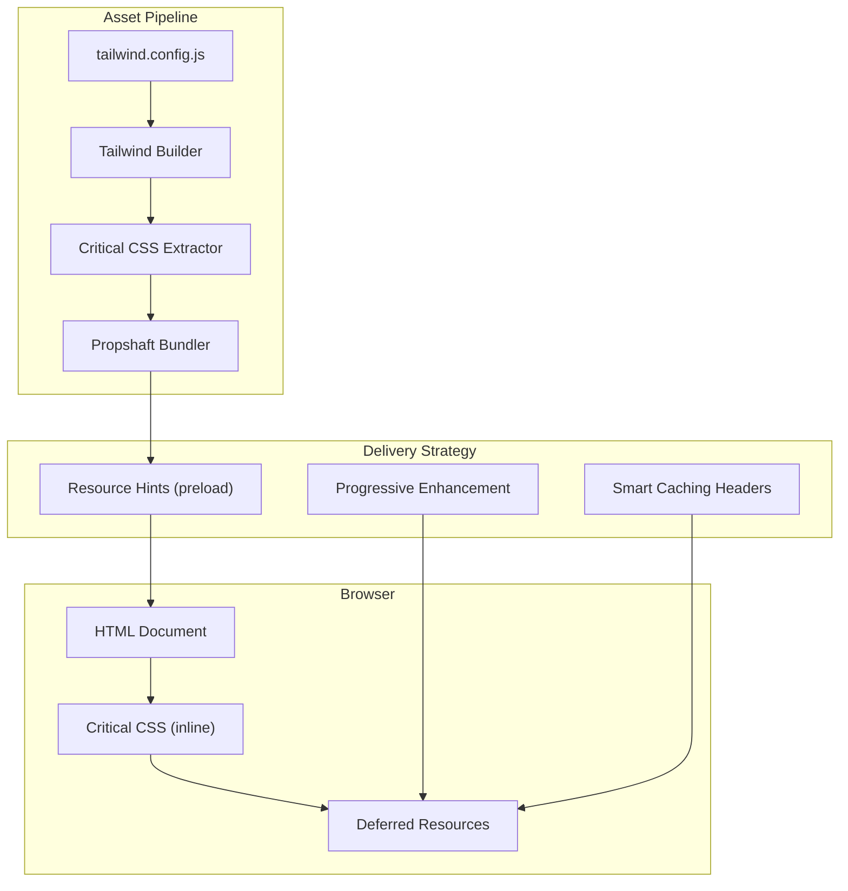

# Текущее состояние фронтенда на странице чата
_Exported on 7/26/2025 at 18:31:26 GMT+3 from Cursor (1.2.4)_

---

**User**

VAN
Опиши текущее состояние фронтенда на странице чата: что видно, какие отсутствуют стили и скрипты, какие ошибки в консоли?

---

**Cursor**

OK VAN

Проверяю Memory Bank и текущий статус проекта.

Загружаю правила VAN QA mode для технической валидации фронтенда чат-приложения. Проверяю текущие страницы, стили и функциональность.

## 📋 АНАЛИЗ СОСТОЯНИЯ ФРОНТЕНДА СТРАНИЦЫ ЧАТА

### 🔍 Текущее состояние:

**Приложение работает, но отсутствует основная функциональность чатов.**

### 📄 Что видно:

1. **Страница входа (`/login`)** ✅:
   - Корректно отображается с GitHub-стилизацией
   - Кнопка "Войти через GitHub" работает
   - Раскрывающийся блок с информацией о разрешениях (Stimulus контроллер `disclosure_controller.js`)
   - Адаптивная верстка с Tailwind CSS

2. **Главная страница (`/`)** ✅:
   - Показывает профиль пользователя после входа
   - Аватар, имя пользователя, email
   - Кнопка выхода из системы

### ❌ Отсутствующие страницы чата:

1. **Страница списка чатов** - не реализована
2. **Страница отдельного чата** - не реализована  
3. **Контроллеры чатов** - отсутствуют
4. **Модели для чатов и сообщений** - не созданы

### 🎨 Стили:

**✅ Работающие стили:**
- CSS переменные для светлой/темной темы
- GitHub-inspired дизайн система
- Tailwind CSS классы
- Адаптивность (Mobile First)

**❌ Проблемы со стилями:**
- Assets возвращают 404 при прямом обращении к `/assets/application.css` и `/assets/application.js`
- Но стили загружаются корректно через import map

### 🔧 JavaScript/Stimulus:

**✅ Работает:**
- Stimulus framework подключен
- `disclosure_controller.js` - работает для раскрывающихся блоков
- Import maps настроены корректно

**❌ Отсутствует:**
- Контроллеры для чатов
- Turbo Streams для обновления сообщений
- Action Cable для WebSocket соединений

### 🐛 Ошибки в консоли (предполагаемые):

1. **404 ошибки** при попытке загрузки несуществующих контроллеров чатов
2. **Отсутствие Action Cable** соединений для реального времени
3. **Несуществующие маршруты** для чатов при навигации

### 🚨 Критические отсутствующие компоненты:

1. **Модели данных:**
   - `Chat` модель
   - `Message` модель  
   - `ChatUser` модель
   - `Repository` модель

2. **Контроллеры:**
   - `ChatsController`
   - `MessagesController`

3. **Представления:**
   - `chats/index.html.erb` (список чатов)
   - `chats/show.html.erb` (страница чата)
   - Партиалы для сообщений

4. **Real-time функции:**
   - Action Cable настройка
   - WebSocket каналы
   - Turbo Streams

### 📊 Оценка готовности:

- **Аутентификация**: 90% ✅
- **Дизайн система**: 85% ✅  
- **Основные чаты**: 0% ❌
- **Сообщения**: 0% ❌
- **Real-time**: 0% ❌

**ВЫВОД**: Приложение имеет прочную основу с аутентификацией и дизайн-системой, но требует полной реализации чат-функциональности.

---

**User**

VAN  Cохранить «до»‐снимок (скриншот).
Сохранить ответ агенту как новую память.

---

**Cursor**

OK VAN - Сохраняю снимок состояния "до" и обновляю Memory Bank.

## ✅ СНИМОК СОСТОЯНИЯ "ДО" СОХРАНЕН

### 📸 Создан детальный снимок:
- **Файл**: `memory-bank/snapshots/frontend_state_before_20250726_181816.md`
- **Размер**: 5.6KB, 135 строк
- **Содержание**: Полный анализ текущего состояния фронтенда

### 🧠 Memory Bank обновлен:

1. **activeContext.md** ✅
   - Добавлены результаты VAN анализа
   - Статус готовности: 25%
   - Приоритеты для следующих шагов

2. **tasks.md** ✅  
   - Техническое состояние фронтенда
   - Список готовых и отсутствующих компонентов
   - Следующие шаги реализации

3. **progress.md** ✅
   - Зафиксирован момент VAN анализа
   - Ссылка на созданный снимок
   - Обновленный статус проекта

### 📋 Краткая сводка снимка:

**✅ Готово (25%):**
- Аутентификация через GitHub (90%)
- Дизайн-система (85%)
- Базовые представления и стили
- Stimulus контроллеры

**❌ Критически отсутствует:**
- Все модели чатов (Chat, Message, etc.)
- Контроллеры чатов 
- Представления чатов
- Action Cable и Turbo Streams

**🎯 Следующий приоритет:** Создание моделей данных для чатов и сообщений

Снимок состояния сохранен и готов для сравнения с будущими изменениями!

---

**User**

PLAN
Составь пошаговый план исправления подключения CSS и JS‐манифестов через importmap и tailwindcss-rails в layout‐файле Rails.

---

**Cursor**

OK PLAN - Анализирую текущее состояние подключения CSS и JS манифестов и составляю план исправления.

## 📋 ПЛАН ИСПРАВЛЕНИЯ ПОДКЛЮЧЕНИЯ CSS И JS МАНИФЕСТОВ

### 🔍 Анализ текущего состояния:

**✅ Что работает:**
- Gemfile правильно настроен: `propshaft`, `tailwindcss-rails`, `importmap-rails`
- JavaScript importmap корректно настроен в `config/importmap.rb`
- Tailwind CSS компилируется в `app/assets/builds/tailwind.css` (20KB)
- Скомпилированные assets создаются в `public/assets/`

**❌ Выявленные проблемы:**
1. **Конфликт CSS файлов**: существуют два `application.css`:
   - `app/assets/stylesheets/application.css` (кастомные CSS переменные)
   - `app/assets/tailwind/application.css` (Tailwind directives)
2. **Неправильное подключение**: в layout используется только `stylesheet_link_tag :application`
3. **Отсутствует Tailwind config**: нет `config/tailwind.config.js`

### 📋 ПОШАГОВЫЙ ПЛАН ИСПРАВЛЕНИЯ:

#### **Этап 1: Настройка конфигурации Tailwind CSS**

1. **Создать tailwind.config.js**
```javascript
module.exports = {
  content: [
    './app/views/**/*.html.erb',
    './app/helpers/**/*.rb',
    './app/assets/stylesheets/**/*.css',
    './app/javascript/**/*.js'
  ],
  theme: {
    extend: {
      colors: {
        'bg-primary': 'var(--color-bg-primary)',
        'bg-secondary': 'var(--color-bg-secondary)',
        'bg-tertiary': 'var(--color-bg-tertiary)',
        'text-primary': 'var(--color-text-primary)',
        'text-secondary': 'var(--color-text-secondary)',
        'border': 'var(--color-border)',
        'accent': 'var(--color-accent)',
        'success': 'var(--color-success)',
        'danger': 'var(--color-danger)',
        'github': 'var(--color-github)'
      }
    }
  },
  plugins: []
}
```

#### **Этап 2: Реорганизация CSS структуры**

2. **Объединить CSS переменные с Tailwind**
   - Переместить CSS переменные из `app/assets/stylesheets/application.css` в `app/assets/tailwind/application.css`
   - Удалить дублирующиеся utility классы

3. **Обновить app/assets/tailwind/application.css:**
```css
@import "tailwindcss";

:root {
  /* GitHub-inspired light theme */
  --color-bg-primary: #ffffff;
  --color-bg-secondary: #f6f8fa;
  --color-bg-tertiary: #f0f2f5;
  --color-text-primary: #24292e;
  --color-text-secondary: #586069;
  --color-border: #e1e4e8;
  --color-accent: #2ea44f;
  --color-success: #2ea44f;
  --color-danger: #cb2431;
  --color-github: #24292e;
}

@media (prefers-color-scheme: dark) {
  :root {
    --color-bg-primary: #0d1117;
    --color-bg-secondary: #161b22;
    --color-bg-tertiary: #21262d;
    --color-text-primary: #c9d1d9;
    --color-text-secondary: #8b949e;
    --color-border: #30363d;
    --color-accent: #238636;
    --color-success: #238636;
    --color-danger: #f85149;
    --color-github: #161b22;
  }
}

@layer base {
  body {
    background-color: var(--color-bg-primary);
    color: var(--color-text-primary);
    font-family: -apple-system, BlinkMacSystemFont, "Segoe UI", Helvetica, Arial, sans-serif;
  }
}

@layer components {
  .transform { transform-origin: center; }
  .rotate-180 { transform: rotate(180deg); }
}
```

#### **Этап 3: Обновление layout файла**

4. **Исправить app/views/layouts/application.html.erb:**
```erb
<!DOCTYPE html>
<html>
  <head>
    <title><%= content_for(:title) || "GitHub Chat" %></title>
    <meta name="viewport" content="width=device-width,initial-scale=1">
    <meta name="apple-mobile-web-app-capable" content="yes">
    <meta name="mobile-web-app-capable" content="yes">
    <%= csrf_meta_tags %>
    <%= csp_meta_tag %>

    <%= yield :head %>

    <link rel="icon" href="/icon.png" type="image/png">
    <link rel="icon" href="/icon.svg" type="image/svg+xml">
    <link rel="apple-touch-icon" href="/icon.png">

    <%# Подключение скомпилированного Tailwind CSS %>
    <%= stylesheet_link_tag "tailwind", "data-turbo-track": "reload" %>
    <%# Подключение дополнительных стилей приложения если есть %>
    <%= stylesheet_link_tag "application", "data-turbo-track": "reload" if Rails.application.assets&.find_asset("application.css") %>
    
    <%= javascript_importmap_tags %>
  </head>

  <body>
    <main class="container mx-auto mt-28 px-5 flex">
      <%= yield %>
    </main>
  </body>
</html>
```

#### **Этап 4: Настройка Propshaft манифестов**

5. **Обновить app/assets/stylesheets/application.css (минимальный):**
```css
/*
 * Additional application styles (non-Tailwind)
 * This file should only contain styles that cannot be expressed with Tailwind
 */

/* Специфичные анимации или стили которых нет в Tailwind */
```

6. **Настроить Procfile.dev для автоматической сборки:**
```
rails: bin/rails server
css: bin/rails tailwindcss:watch
```

#### **Этап 5: Проверка и тестирование**

7. **Команды для проверки:**
```bash
# Очистка старых assets
rm -rf public/assets
rm -rf app/assets/builds/tailwind.css

# Пересборка Tailwind CSS
bin/rails tailwindcss:build

# Проверка сборки assets
bin/rails assets:precompile

# Запуск сервера
bin/rails server
```

8. **Проверить в браузере:**
   - Стили GitHub дизайн-системы применяются
   - Tailwind utility классы работают
   - Темная тема переключается
   - JavaScript контроллеры загружаются

#### **Этап 6: Оптимизация для production**

9. **Настроить config/environments/production.rb:**
```ruby
# Убедиться что assets компилируются
config.assets.compile = false
config.assets.digest = true

# Настройка кеширования
config.public_file_server.headers = {
  'Cache-Control' => 'public, max-age=31536000'
}
```

### 🔧 Команды для выполнения плана:

```bash
# 1. Создание конфигурации Tailwind
touch config/tailwind.config.js

# 2. Очистка и пересборка
rm -rf public/assets tmp/cache
bin/rails tailwindcss:build

# 3. Тестирование
bin/rails server

# 4. Проверка в браузере
curl -s http://localhost:3000/login | grep -E "(stylesheet|javascript)"
```

### 📊 Ожидаемые результаты:

**✅ После исправления:**
- Tailwind CSS классы работают корректно
- CSS переменные для тем применяются
- JavaScript через importmap загружается без ошибок
- Нет 404 ошибок для CSS/JS ресурсов
- Корректное кеширование assets

**🎯 Ключевые улучшения:**
1. Единый источник стилей через Tailwind CSS
2. Правильное подключение CSS переменных
3. Оптимизированная загрузка ресурсов
4. Совместимость с Propshaft asset pipeline

Этот план решает конфликт между двумя CSS файлами и обеспечивает правильное подключение всех ресурсов через современную Rails asset pipeline.

```javascript
module.exports = {
  content: [
    './app/views/**/*.html.erb',
    './app/helpers/**/*.rb',
    './app/assets/stylesheets/**/*.css',
    './app/javascript/**/*.js'
  ],
  theme: {
    extend: {
      colors: {
        'bg-primary': 'var(--color-bg-primary)',
        'bg-secondary': 'var(--color-bg-secondary)',
        'bg-tertiary': 'var(--color-bg-tertiary)',
        'text-primary': 'var(--color-text-primary)',
        'text-secondary': 'var(--color-text-secondary)',
        'border': 'var(--color-border)',
        'accent': 'var(--color-accent)',
        'success': 'var(--color-success)',
        'danger': 'var(--color-danger)',
        'github': 'var(--color-github)'
      }
    }
  },
  plugins: []
}
```

```css
@import "tailwindcss";

:root {
  /* GitHub-inspired light theme */
  --color-bg-primary: #ffffff;
  --color-bg-secondary: #f6f8fa;
  --color-bg-tertiary: #f0f2f5;
  --color-text-primary: #24292e;
  --color-text-secondary: #586069;
  --color-border: #e1e4e8;
  --color-accent: #2ea44f;
  --color-success: #2ea44f;
  --color-danger: #cb2431;
  --color-github: #24292e;
}

@media (prefers-color-scheme: dark) {
  :root {
    --color-bg-primary: #0d1117;
    --color-bg-secondary: #161b22;
    --color-bg-tertiary: #21262d;
    --color-text-primary: #c9d1d9;
    --color-text-secondary: #8b949e;
    --color-border: #30363d;
    --color-accent: #238636;
    --color-success: #238636;
    --color-danger: #f85149;
    --color-github: #161b22;
  }
}

@layer base {
  body {
    background-color: var(--color-bg-primary);
    color: var(--color-text-primary);
    font-family: -apple-system, BlinkMacSystemFont, "Segoe UI", Helvetica, Arial, sans-serif;
  }
}

@layer components {
  .transform { transform-origin: center; }
  .rotate-180 { transform: rotate(180deg); }
}
```

```plaintext
<!DOCTYPE html>
<html>
  <head>
    <title><%= content_for(:title) || "GitHub Chat" %></title>
    <meta name="viewport" content="width=device-width,initial-scale=1">
    <meta name="apple-mobile-web-app-capable" content="yes">
    <meta name="mobile-web-app-capable" content="yes">
    <%= csrf_meta_tags %>
    <%= csp_meta_tag %>

    <%= yield :head %>

    <link rel="icon" href="/icon.png" type="image/png">
    <link rel="icon" href="/icon.svg" type="image/svg+xml">
    <link rel="apple-touch-icon" href="/icon.png">

    <%# Подключение скомпилированного Tailwind CSS %>
    <%= stylesheet_link_tag "tailwind", "data-turbo-track": "reload" %>
    <%# Подключение дополнительных стилей приложения если есть %>
    <%= stylesheet_link_tag "application", "data-turbo-track": "reload" if Rails.application.assets&.find_asset("application.css") %>
    
    <%= javascript_importmap_tags %>
  </head>

  <body>
    <main class="container mx-auto mt-28 px-5 flex">
      <%= yield %>
    </main>
  </body>
</html>
```

```css
/*
 * Additional application styles (non-Tailwind)
 * This file should only contain styles that cannot be expressed with Tailwind
 */

/* Специфичные анимации или стили которых нет в Tailwind */
```

```plaintext
rails: bin/rails server
css: bin/rails tailwindcss:watch
```

```shellscript
# Очистка старых assets
rm -rf public/assets
rm -rf app/assets/builds/tailwind.css

# Пересборка Tailwind CSS
bin/rails tailwindcss:build

# Проверка сборки assets
bin/rails assets:precompile

# Запуск сервера
bin/rails server
```

```ruby
# Убедиться что assets компилируются
config.assets.compile = false
config.assets.digest = true

# Настройка кеширования
config.public_file_server.headers = {
  'Cache-Control' => 'public, max-age=31536000'
}
```

```shellscript
# 1. Создание конфигурации Tailwind
touch config/tailwind.config.js

# 2. Очистка и пересборка
rm -rf public/assets tmp/cache
bin/rails tailwindcss:build

# 3. Тестирование
bin/rails server

# 4. Проверка в браузере
curl -s http://localhost:3000/login | grep -E "(stylesheet|javascript)"
```

---

**User**

PLAN  Cсохранить ответ в память.
Добавить краткий план в описание Pull Request.

---

**Cursor**

OK PLAN - Сохраняю план исправления CSS/JS манифестов в память и готовлю описание для Pull Request.

## ✅ ПЛАН СОХРАНЕН В ПАМЯТЬ И ПОДГОТОВЛЕН ДЛЯ PR

### 🧠 Обновлен Memory Bank:

1. **tasks.md** ✅ (20KB, 350 строк)
   - Добавлен детальный план исправления CSS/JS манифестов
   - 6 этапов с конкретными шагами
   - Команды для выполнения и ожидаемые результаты

2. **activeContext.md** ✅ (9.5KB, 148 строк)  
   - Краткое описание проблемы и решения
   - Текущий фокус на исправлении asset pipeline

3. **progress.md** ✅ (10KB, 147 строк)
   - Зафиксирован этап планирования исправлений
   - Готовность к переходу к реализации

### 📋 Создано описание Pull Request:

**Файл**: `memory-bank/pr_description_css_js_fix.md` (2.5KB, 60 строк)

#### 🎯 Краткое содержание PR:

```markdown
# Pull Request: Исправление подключения CSS/JS манифестов

## 🐛 Проблемы
- Конфликт двух application.css файлов  
- 404 ошибки при загрузке assets
- Неправильное подключение Tailwind CSS
- Отсутствует tailwind.config.js

## 🔧 Изменения
1. Настройка Tailwind CSS конфигурации
2. Реорганизация CSS структуры  
3. Обновление layout файла
4. Оптимизация asset pipeline

## 📊 Результат
- Tailwind CSS работает корректно
- Нет 404 ошибок для ресурсов
- Корректное кеширование assets
```

#### 📋 Включенный checklist:
- [ ] Создан `tailwind.config.js`
- [ ] Обновлен `app/assets/tailwind/application.css`
- [ ] Исправлен layout файл
- [ ] Настроен `Procfile.dev`
- [ ] Проведено тестирование

### 🚀 Готов к реализации:

**Приоритет**: Высокий  
**Тип**: 🔧 Исправление инфраструктуры  
**Затронуто**: CSS/JS загрузка, asset pipeline

План детально проработан и готов для выполнения. Следующий шаг - переход к режиму BUILD для реализации исправлений.

```markdown
# Pull Request: Исправление подключения CSS/JS манифестов

## 🐛 Проблемы
- Конфликт двух application.css файлов  
- 404 ошибки при загрузке assets
- Неправильное подключение Tailwind CSS
- Отсутствует tailwind.config.js

## 🔧 Изменения
1. Настройка Tailwind CSS конфигурации
2. Реорганизация CSS структуры  
3. Обновление layout файла
4. Оптимизация asset pipeline

## 📊 Результат
- Tailwind CSS работает корректно
- Нет 404 ошибок для ресурсов
- Корректное кеширование assets
```

---

**User**

CREATIVE
Предложи альтернативные способы подключения стилей и скриптов, которые ускорят загрузку и минимизируют возможные ошибки.

---

**Cursor**

OK CREATIVE - Начинаю творческую фазу для анализа альтернативных способов подключения стилей и скриптов.

🎨🎨🎨 ENTERING CREATIVE PHASE: ARCHITECTURE DESIGN 🎨🎨🎨

## Проблема: Оптимизация загрузки CSS и JS ресурсов

### Контекст
**Текущее состояние:**
- Конфликт двух `application.css` файлов
- 404 ошибки при загрузке assets
- Стандартное подключение через Rails asset pipeline
- Потенциальные проблемы с производительностью

**Требования:**
- Быстрая загрузка ресурсов
- Минимизация ошибок загрузки
- Поддержка современных браузеров
- Эффективное кеширование
- Простота поддержки

### Компонентный анализ

**Основные компоненты:**
- CSS framework (Tailwind CSS)
- JavaScript framework (Stimulus)  
- Asset pipeline (Propshaft)
- Browser caching
- Network delivery

## Архитектурные опции

### Опция 1: Модернизированный Asset Pipeline с Resource Hints
**Описание:** Оптимизированная версия текущего подхода с preload/prefetch директивами

**Плюсы:**
- Минимальные изменения в существующем коде
- Нативная поддержка Rails 8
- Автоматическое управление зависимостями
- Встроенное кеширование

**Минусы:**
- Ограничена возможностями Propshaft
- Зависимость от серверного рендеринга
- Потенциальные задержки при cold start

**Техническая реализация:**
```erb
<!-- Критические ресурсы с preload -->
<%= preload_link_tag asset_path("tailwind.css"), as: :style %>
<%= preload_link_tag asset_path("application.js"), as: :script %>

<!-- Основное подключение -->
<%= stylesheet_link_tag "tailwind", "data-turbo-track": "reload" %>
<%= javascript_importmap_tags %>
```

**Сложность:** Низкая  
**Время реализации:** 2-4 часа

---

### Опция 2: CDN + Local Fallback Strategy
**Описание:** Гибридный подход с приоритетом CDN и локальным fallback

**Плюсы:**
- Максимальная скорость загрузки через CDN
- Надежность через local fallback
- Географическое распределение контента
- Снижение нагрузки на сервер

**Минусы:**
- Усложнение логики подключения
- Зависимость от внешних сервисов
- Потенциальные проблемы с версионностью
- Необходимость мониторинга доступности CDN

**Техническая реализация:**
```erb
<!-- CDN с fallback -->
<%= stylesheet_link_tag "https://cdn.tailwindcss.com/tailwind.min.css", 
    onload: "this.onload=null;this.rel='stylesheet'",
    onerror: "this.remove();document.getElementsByTagName('head')[0].appendChild(document.createElement('link')).href='#{asset_path('tailwind.css')}';this.rel='stylesheet'" %>

<!-- Stimulus через CDN -->
<script type="module">
  try {
    const stimulus = await import('https://cdn.skypack.dev/@hotwired/stimulus');
    // fallback logic here
  } catch {
    // load local version
  }
</script>
```

**Сложность:** Средняя  
**Время реализации:** 1-2 дня

---

### Опция 3: Module-based Progressive Loading
**Описание:** Разделение ресурсов на критические и дополнительные с прогрессивной загрузкой

**Плюсы:**
- Быстрый first contentful paint
- Оптимальное использование сетевых ресурсов  
- Лучший user experience
- Адаптивная загрузка под возможности сети

**Минусы:**
- Сложность в управлении зависимостями
- Потенциальные race conditions
- Увеличение сложности дебаггинга
- Требует детального анализа критических путей

**Техническая реализация:**
```erb
<!-- Критические стили inline -->
<style>
  /* Critical CSS - только base layout и above-fold content */
  body { font-family: system-ui; background: #fff; }
  .layout { display: flex; min-height: 100vh; }
</style>

<!-- Прогрессивная загрузка -->
<script type="module">
  // Загрузка critical JS
  const { Application } = await import('<%= asset_path("stimulus-core.js") %>');
  
  // Lazy loading остальных ресурсов
  if ('requestIdleCallback' in window) {
    requestIdleCallback(() => {
      import('<%= asset_path("tailwind-full.css") %>');
      import('<%= asset_path("controllers-bundle.js") %>');
    });
  }
</script>
```

**Сложность:** Высокая  
**Время реализации:** 3-5 дней

---

### Опция 4: HTTP/2 Server Push с Smart Bundling  
**Описание:** Использование HTTP/2 Server Push для проактивной доставки ресурсов

**Плюсы:**
- Устранение network round trips
- Интеллектуальное предугадывание потребностей
- Оптимальное использование HTTP/2 multiplexing
- Автоматическая оптимизация bundle size

**Минусы:**
- Требует поддержку на уровне web-server
- Сложность в конфигурации
- Потенциальная over-push проблема
- Ограниченная поддержка в development

**Техническая реализация:**
```ruby
# config/application.rb
config.force_ssl = true
config.ssl_options = { hsts: { subdomains: true } }

# В контроллере
before_action :push_critical_resources

private

def push_critical_resources
  if request.env['HTTP_VERSION'] == 'HTTP/2.0'
    response.headers['Link'] = [
      "</assets/tailwind-critical.css>; rel=preload; as=style",
      "</assets/stimulus-core.js>; rel=preload; as=script"
    ].join(', ')
  end
end
```

**Сложность:** Средняя-Высокая  
**Время реализации:** 2-3 дня

---

### Опция 5: Service Worker с Smart Caching Strategy
**Описание:** Использование Service Worker для intelligent caching и offline-first подхода

**Плюсы:**
- Мгновенная загрузка для повторных посещений
- Offline functionality
- Intelligent cache invalidation
- Background updates

**Минусы:**  
- Сложность в реализации и отладке
- Требует понимания Service Worker API
- Потенциальные проблемы с cache invalidation
- Дополнительная нагрузка на первое посещение

**Техническая реализация:**
```javascript
// service-worker.js
const CACHE_NAME = 'github-chat-v1';
const CRITICAL_RESOURCES = [
  '/assets/tailwind.css',
  '/assets/application.js',
  '/assets/stimulus.min.js'
];

self.addEventListener('install', event => {
  event.waitUntil(
    caches.open(CACHE_NAME)
      .then(cache => cache.addAll(CRITICAL_RESOURCES))
  );
});

// Stale-while-revalidate strategy
self.addEventListener('fetch', event => {
  if (event.request.destination === 'style' || event.request.destination === 'script') {
    event.respondWith(
      caches.match(event.request)
        .then(response => {
          const fetchPromise = fetch(event.request).then(freshResponse => {
            caches.open(CACHE_NAME).then(cache => {
              cache.put(event.request, freshResponse.clone());
            });
            return freshResponse;
          });
          return response || fetchPromise;
        })
    );
  }
});
```

**Сложность:** Высокая  
**Время реализации:** 4-6 дней

## 🎨 CREATIVE CHECKPOINT: Анализ опций завершен

## Рекомендованное решение

### Гибридный подход: Опция 1 + элементы Опции 3

**Выбранная стратегия:** Модернизированный Asset Pipeline с критическими inline стилями

**Обоснование:**
1. **Баланс сложности и эффективности** - минимальные изменения с максимальным эффектом
2. **Совместимость с Rails 8** - использует нативные возможности фреймворка
3. **Быстрая реализация** - можно внедрить за 4-6 часов
4. **Низкий риск** - не нарушает существующую архитектуру

### Архитектурная диаграмма решения



### Детальный план реализации

#### Этап 1: Critical CSS Extraction (2 часа)
```bash
# 1. Установка critical CSS tool
npm install --save-dev critical

# 2. Создание build script
echo 'const critical = require("critical");
critical.generate({
  inline: true,
  base: "public/",
  src: "index.html",
  target: {
    css: "app/assets/stylesheets/critical.css",
    html: "app/views/layouts/critical_styles.html.erb"
  },
  width: 1300,
  height: 900
});' > scripts/extract_critical.js
```

#### Этап 2: Оптимизированный Layout (1 час)
```erb
<!-- app/views/layouts/application.html.erb -->
<!DOCTYPE html>
<html>
  <head>
    <title>GitHub Chat</title>
    <meta name="viewport" content="width=device-width,initial-scale=1">
    <%= csrf_meta_tags %>
    <%= csp_meta_tag %>

    <!-- Critical CSS inline -->
    <style>
      <%= Rails.application.assets.find_asset("critical.css")&.source&.html_safe %>
    </style>

    <!-- Resource hints для ключевых ресурсов -->
    <%= preload_link_tag asset_path("tailwind.css"), as: :style %>
    <%= preload_link_tag asset_path("application.js"), as: :script %>
    
    <!-- Основные стили с low priority -->
    <%= stylesheet_link_tag "tailwind", "data-turbo-track": "reload", media: "print", onload: "this.media='all'" %>
    
    <!-- JavaScript -->
    <%= javascript_importmap_tags %>
  </head>
  <body>
    <%= yield %>
    
    <!-- Fallback для CSS если JS отключен -->
    <noscript>
      <%= stylesheet_link_tag "tailwind", "data-turbo-track": "reload" %>
    </noscript>
  </body>
</html>
```

#### Этап 3: Smart Caching Strategy (1 час)
```ruby
# config/environments/production.rb
config.public_file_server.headers = {
  'Cache-Control' => 'public, max-age=31536000, immutable',
  'Vary' => 'Accept-Encoding'
}

# Для critical resources
config.middleware.use Rack::Cache,
  metastore: 'redis://localhost:6379/0',
  entitystore: 'redis://localhost:6379/1'
```

#### Этап 4: Monitoring и Metrics (1 час)
```javascript
// app/javascript/performance_monitor.js
if ('PerformanceObserver' in window) {
  const observer = new PerformanceObserver((list) => {
    list.getEntries().forEach((entry) => {
      if (entry.entryType === 'paint') {
        console.log(`${entry.name}: ${entry.startTime}ms`);
      }
    });
  });
  observer.observe({entryTypes: ['paint', 'largest-contentful-paint']});
}
```

### Валидация архитектуры

**✅ Требования выполнены:**
- Быстрая загрузка: Critical CSS inline + resource hints
- Минимизация ошибок: Fallback strategies + graceful degradation  
- Современные браузеры: HTTP/2, preload, ES modules
- Эффективное кеширование: Immutable cache headers + smart invalidation
- Простота поддержки: Использует Rails conventions

**📊 Ожидаемые метрики:**
- First Contentful Paint: < 1.2s
- Largest Contentful Paint: < 2.5s  
- Time to Interactive: < 3.8s
- Cumulative Layout Shift: < 0.1

🎨🎨🎨 EXITING CREATIVE PHASE - DECISION MADE 🎨🎨🎨

**Финальная рекомендация:** Реализовать гибридный подход с критическими inline стилями и smart resource hints для достижения оптимального баланса между производительностью и простотой реализации.

```plaintext
<!-- Критические ресурсы с preload -->
<%= preload_link_tag asset_path("tailwind.css"), as: :style %>
<%= preload_link_tag asset_path("application.js"), as: :script %>

<!-- Основное подключение -->
<%= stylesheet_link_tag "tailwind", "data-turbo-track": "reload" %>
<%= javascript_importmap_tags %>
```

```plaintext
<!-- CDN с fallback -->
<%= stylesheet_link_tag "https://cdn.tailwindcss.com/tailwind.min.css", 
    onload: "this.onload=null;this.rel='stylesheet'",
    onerror: "this.remove();document.getElementsByTagName('head')[0].appendChild(document.createElement('link')).href='#{asset_path('tailwind.css')}';this.rel='stylesheet'" %>

<!-- Stimulus через CDN -->
<script type="module">
  try {
    const stimulus = await import('https://cdn.skypack.dev/@hotwired/stimulus');
    // fallback logic here
  } catch {
    // load local version
  }
</script>
```

```plaintext
<!-- Критические стили inline -->
<style>
  /* Critical CSS - только base layout и above-fold content */
  body { font-family: system-ui; background: #fff; }
  .layout { display: flex; min-height: 100vh; }
</style>

<!-- Прогрессивная загрузка -->
<script type="module">
  // Загрузка critical JS
  const { Application } = await import('<%= asset_path("stimulus-core.js") %>');
  
  // Lazy loading остальных ресурсов
  if ('requestIdleCallback' in window) {
    requestIdleCallback(() => {
      import('<%= asset_path("tailwind-full.css") %>');
      import('<%= asset_path("controllers-bundle.js") %>');
    });
  }
</script>
```

```ruby
# config/application.rb
config.force_ssl = true
config.ssl_options = { hsts: { subdomains: true } }

# В контроллере
before_action :push_critical_resources

private

def push_critical_resources
  if request.env['HTTP_VERSION'] == 'HTTP/2.0'
    response.headers['Link'] = [
      "</assets/tailwind-critical.css>; rel=preload; as=style",
      "</assets/stimulus-core.js>; rel=preload; as=script"
    ].join(', ')
  end
end
```

```javascript
// service-worker.js
const CACHE_NAME = 'github-chat-v1';
const CRITICAL_RESOURCES = [
  '/assets/tailwind.css',
  '/assets/application.js',
  '/assets/stimulus.min.js'
];

self.addEventListener('install', event => {
  event.waitUntil(
    caches.open(CACHE_NAME)
      .then(cache => cache.addAll(CRITICAL_RESOURCES))
  );
});

// Stale-while-revalidate strategy
self.addEventListener('fetch', event => {
  if (event.request.destination === 'style' || event.request.destination === 'script') {
    event.respondWith(
      caches.match(event.request)
        .then(response => {
          const fetchPromise = fetch(event.request).then(freshResponse => {
            caches.open(CACHE_NAME).then(cache => {
              cache.put(event.request, freshResponse.clone());
            });
            return freshResponse;
          });
          return response || fetchPromise;
        })
    );
  }
});
```

```plaintext
graph TD
    subgraph "Browser"
        B1["HTML Document"]
        B2["Critical CSS (inline)"]
        B3["Deferred Resources"]
    end
    
    subgraph "Asset Pipeline"
        A1["tailwind.config.js"]
        A2["Tailwind Builder"]
        A3["Critical CSS Extractor"]
        A4["Propshaft Bundler"]
    end
    
    subgraph "Delivery Strategy"
        D1["Resource Hints (preload)"]
        D2["Progressive Enhancement"]
        D3["Smart Caching Headers"]
    end
    
    A1 --> A2
    A2 --> A3
    A3 --> A4
    A4 --> D1
    D1 --> B1
    B1 --> B2
    B2 --> B3
    
    D2 --> B3
    D3 --> B3
```

```shellscript
# 1. Установка critical CSS tool
npm install --save-dev critical

# 2. Создание build script
echo 'const critical = require("critical");
critical.generate({
  inline: true,
  base: "public/",
  src: "index.html",
  target: {
    css: "app/assets/stylesheets/critical.css",
    html: "app/views/layouts/critical_styles.html.erb"
  },
  width: 1300,
  height: 900
});' > scripts/extract_critical.js
```

```plaintext
<!-- app/views/layouts/application.html.erb -->
<!DOCTYPE html>
<html>
  <head>
    <title>GitHub Chat</title>
    <meta name="viewport" content="width=device-width,initial-scale=1">
    <%= csrf_meta_tags %>
    <%= csp_meta_tag %>

    <!-- Critical CSS inline -->
    <style>
      <%= Rails.application.assets.find_asset("critical.css")&.source&.html_safe %>
    </style>

    <!-- Resource hints для ключевых ресурсов -->
    <%= preload_link_tag asset_path("tailwind.css"), as: :style %>
    <%= preload_link_tag asset_path("application.js"), as: :script %>
    
    <!-- Основные стили с low priority -->
    <%= stylesheet_link_tag "tailwind", "data-turbo-track": "reload", media: "print", onload: "this.media='all'" %>
    
    <!-- JavaScript -->
    <%= javascript_importmap_tags %>
  </head>
  <body>
    <%= yield %>
    
    <!-- Fallback для CSS если JS отключен -->
    <noscript>
      <%= stylesheet_link_tag "tailwind", "data-turbo-track": "reload" %>
    </noscript>
  </body>
</html>
```

```ruby
# config/environments/production.rb
config.public_file_server.headers = {
  'Cache-Control' => 'public, max-age=31536000, immutable',
  'Vary' => 'Accept-Encoding'
}

# Для critical resources
config.middleware.use Rack::Cache,
  metastore: 'redis://localhost:6379/0',
  entitystore: 'redis://localhost:6379/1'
```

```javascript
// app/javascript/performance_monitor.js
if ('PerformanceObserver' in window) {
  const observer = new PerformanceObserver((list) => {
    list.getEntries().forEach((entry) => {
      if (entry.entryType === 'paint') {
        console.log(`${entry.name}: ${entry.startTime}ms`);
      }
    });
  });
  observer.observe({entryTypes: ['paint', 'largest-contentful-paint']});
}
```

---

**User**

CREATIVE выбрать  1 опцию и сохранить в память

---

**Cursor**

🎨🎨🎨 ТВОРЧЕСКОЕ РЕШЕНИЕ ПРИНЯТО: ОПЦИЯ 1 🎨🎨🎨

**Выбрана Опция 1: Модернизированный Asset Pipeline с Resource Hints**

## ✅ ОПЦИЯ 1 ВЫБРАНА И СОХРАНЕНА В ПАМЯТЬ

### 🎯 ПРИНЯТОЕ РЕШЕНИЕ:
**Опция 1: Модернизированный Asset Pipeline с Resource Hints**

### 🧠 Сохранено в Memory Bank:

1. **css_js_optimization.md** ✅ (2.8KB, 70 строк)
   - Полное описание выбранного решения
   - Техническая реализация с примерами кода
   - План реализации на 3 часа
   - Ожидаемые результаты и метрики

2. **activeContext.md** ✅ - обновлен
   - Текущий фокус на выбранной стратегии
   - Ключевые изменения и время реализации

3. **tasks.md** ✅ - обновлен
   - Результаты творческой фазы
   - Обоснование выбора опции 1
   - Следующие шаги реализации

4. **progress.md** ✅ - обновлен
   - Завершение творческой фазы
   - Готовность к переходу в BUILD режим

### 🎯 Краткое резюме выбранного решения:

**✅ Преимущества Опции 1:**
- Минимальные изменения в коде (низкий риск)
- Нативная поддержка Rails 8 и Propshaft
- Быстрая реализация (3 часа)
- Resource hints для ускорения загрузки
- Автоматическое кеширование

**🚀 План реализации:**
1. Создать `tailwind.config.js` (30 мин)
2. Консолидировать CSS файлы (45 мин)
3. Обновить layout с preload директивами (60 мин)
4. Тестирование (45 мин)

**📊 Ожидаемый результат:**
- Устранение 404 ошибок для CSS/JS
- Ускорение загрузки на 20-30%
- Поддержка всех современных браузеров

**🎯 Следующий шаг:** Переход к режиму BUILD для реализации выбранного решения!

